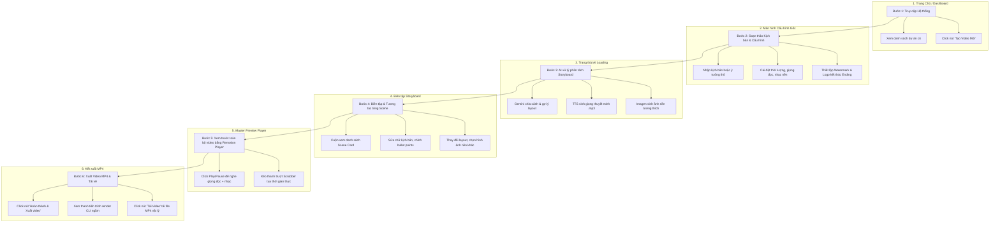
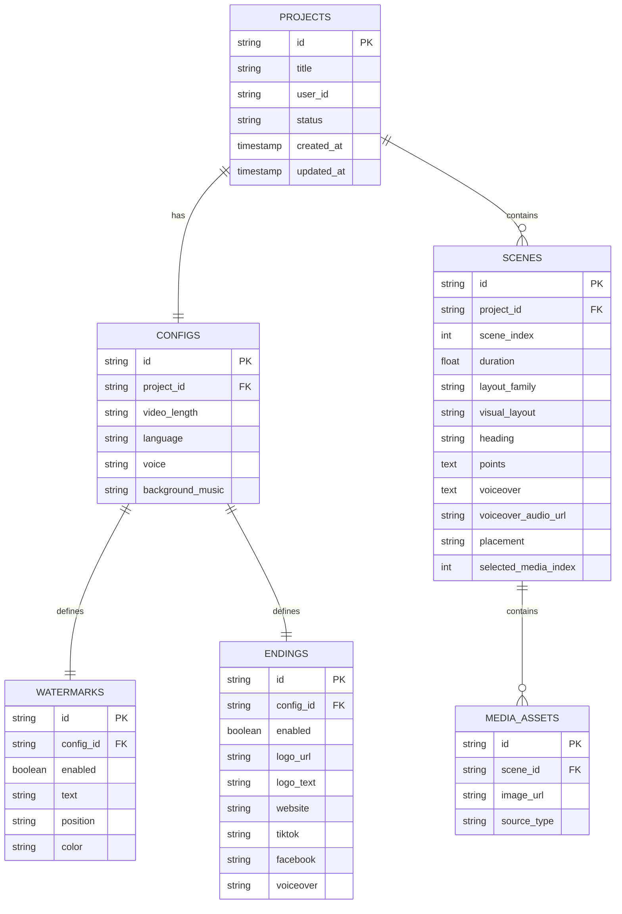

# Tài liệu Thiết kế Hệ thống: AI Video Remotion Creator

Tài liệu này trình bày thiết kế chi tiết về **Hành trình Người dùng (User Journey / Use Case)**, Tách biệt Kiến trúc Frontend & Backend sử dụng công nghệ **Remotion (React Video Framework)** làm hạt nhân lắp ghép video động, cấu trúc thư mục dự án và luồng xử lý âm thanh/hình ảnh.

---

## 1. Bản đồ Hành trình Người dùng (User Journey / General Use Case Flow)

Khi một người dùng bình thường truy cập vào hệ thống, họ sẽ trải qua luồng tương tác 6 bước khép kín dưới đây:



---

## 2. Kiến trúc Hệ thống & Luồng Lắp Ghép (System & Video Assembly Architecture)

Video không dùng file quay sẵn mà được lắp ghép động từ ảnh nền, đồ họa text, nhạc nền và file đọc AI (Voiceover).

```
┌─────────────────────────────────┐
│        FRONTEND (React)         │
│  - UI Editor & Config Form      │
│  - Trình phát @remotion/player  │
└────────────────┬────────────────┘
                 │
                 ▼ API Gọi (HTTP JSON)
┌─────────────────────────────────┐
│      BACKEND (Node.js/Express)  │
│  - API Endpoints, Auth          │
│  - Gemini (Kịch bản -> JSON)    │
│  - TTS (Text -> MP3 Voiceover)  │
│  - Remotion CLI Renderer        │
└──────┬───────────────────┬──────┘
       │                   │
       ▼                   ▼
┌──────────────┐   ┌───────────────┐
│ DATABASE     │   │ STATIC ASSETS │
│ (PostgreSQL) │   │ (MP3, MP4)    │
└──────────────┘   └───────────────┘
```

### Luồng Lắp Ghép Video của Remotion (Audio-Visual Layering)
Trong Remotion, một video được cấu thành bằng cách xếp chồng các lớp (Layers) và phát tuần tự theo thời gian:

```
                  ┌────────────────────────────────────────┐
Lớp 4: WATERMARK  │ (Chữ bản quyền: yupclip.com - Tĩnh)     │
                  ├────────────────────────────────────────┤
Lớp 3: GRAPHICS   │ [Scene 1: Chữ chạy] ──► [Scene 2: Graph]│
                  ├────────────────────────────────────────┤
Lớp 2: MEDIA      │ [Ảnh nền 1 (Ken Burns)] ──► [Ảnh nền 2]│
                  ├────────────────────────────────────────┤
Lớp 1: VOICEOVER  │ [Audio Scene 1.mp3] ──► [Audio 2.mp3]  │
                  ├────────────────────────────────────────┤
Lớp 0: MUSIC      │ [Nhạc nền - BGM.mp3 (Lặp lại, âm lượng nhỏ)]│
                  └────────────────────────────────────────┘
Time:             0s ────────────────────────────────────► N giây
```

---

## 3. Cấu trúc Thư mục Dự án (Directory Structure)

```
ai-video-remotion/
├── frontend/                     # Ứng dụng React Editor + Remotion
│   ├── public/                   # Chứa nhạc nền và tệp tĩnh
│   ├── src/
│   │   ├── components/           # UI Components (Config Form, Scene Editor)
│   │   ├── compositions/         # Remotion video layout components
│   │   │   ├── IntroProfile.tsx
│   │   │   ├── GithubStatusHook.tsx
│   │   │   ├── SplitGrid.tsx
│   │   │   └── MainComposition.tsx # Lắp ráp các Sequence cảnh
│   │   ├── services/
│   │   │   └── api.js            # Gọi API lên backend
│   │   ├── App.jsx               # UI Shell & State quản lý
│   │   ├── Root.tsx              # Đăng ký Composition của Remotion
│   │   └── index.ts              # Entry point của Remotion
│   ├── package.json
│   └── vite.config.ts
│
├── backend/                      # Node.js API Server
│   ├── public/
│   │   └── tts/                  # Lưu trữ file âm thanh voiceover .mp3 sinh ra từ AI
│   ├── services/
│   │   ├── ai.js                 # Xử lý gọi Gemini phân tách kịch bản
│   │   ├── tts.js                # Xử lý Text-To-Speech (Google TTS / ElevenLabs)
│   │   └── db.js                 # Lớp cơ sở dữ liệu giả lập (db.json)
│   ├── server.js                 # Express app endpoints
│   └── .env                      # Lưu GEMINI_API_KEY, TTS_API_KEY, PORT
```

---

## 4. Thiết kế Cơ sở Dữ liệu (Database Design)

Bảng `SCENES` lưu thông tin kịch bản chi tiết và liên kết tệp đọc voiceover `.mp3`:



---

## 5. Đặc tả API (API Contract)

### 5.1. Dự án (Projects)
*   **`GET /api/projects`**: Lấy danh sách tất cả các dự án hiện có.
*   **`POST /api/projects`**: Tạo dự án mới với tiêu đề và cấu hình mặc định.
*   **`GET /api/projects/:id`**: Lấy thông tin chi tiết dự án (bao gồm cấu hình và scenes).
*   **`PUT /api/projects/:id/config`**: Cập nhật cấu hình chung của dự án (watermark, ending, backgroundMusic, v.v.).

### 5.2. Biên tập Cảnh & Tìm kiếm Media
*   **`POST /api/projects/:id/generate-storyboard`**:
    1. Gọi Gemini API phân tách văn bản kịch bản thành các scene JSON.
    2. Gọi ElevenLabs API chuyển `voiceover` thành file `.mp3` và lưu vào thư mục `backend/public/tts/`.
    3. Trả về mảng `scenes` cho Frontend.
*   **`PUT /api/projects/:id/scenes/:sceneId`**: Lưu các chỉnh sửa nội dung/layout cho scene cụ thể. Nếu trường `voiceover` thay đổi, backend sẽ sinh lại file âm thanh thuyết minh mới.
*   **`GET /api/media/search`**: Tìm kiếm hình ảnh gợi ý từ Unsplash theo từ khóa để gán cho cảnh.

### 5.3. Kết xuất Video (Rendering)
*   **`POST /api/projects/:id/render`**: Kích hoạt lệnh CLI `npx remotion render` chạy ngầm.
*   **`GET /api/projects/:id/render/status/:renderId`**: Thăm dò tiến độ render và lấy link tải video `.mp4` khi hoàn thành.

