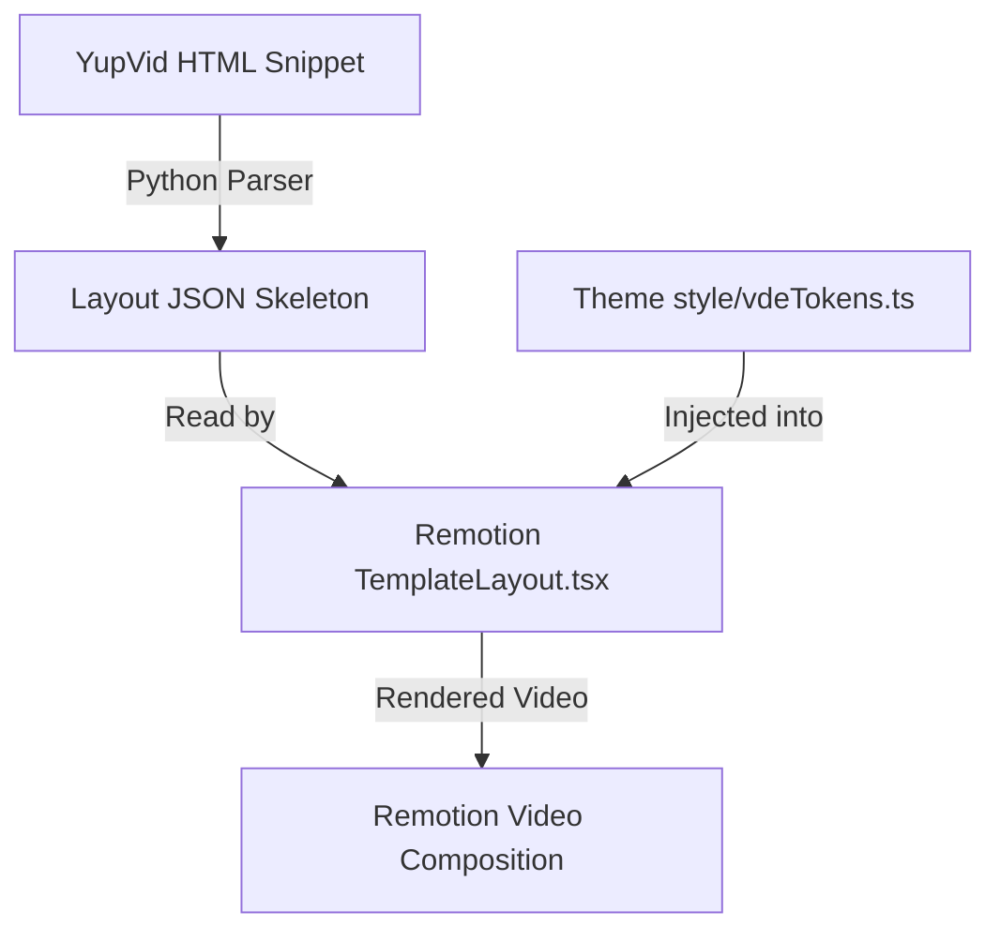

# Design Document: YupVid Skeleton Layouts Engine

This document defines the architecture and design to clone and support hundreds of video layout templates from YupVid by separating **Structure (Skeleton)** from **Skin (Theme)**.

## Goal

To enable copying any HTML/CSS layout representation from YupVid's story editor and automatically translating it into a local, reusable layout skeleton configuration (JSON) that renders dynamically using Remotion and integrates seamlessly with our existing Visual Design Engine (VDE) style tokens.

---

## Architectural Concept

We separate the presentation of a video scene into two independent layers:
1.  **Layout Skeleton (Structure):** Defines margins, padding, layout family, alignment, container grid/flex settings, element positioning, and structural rules (e.g., alternating item rotations, scale ratios). Configured in JSON files.
2.  **Theme (Skin):** Defines colors, typography, border styling, drop shadows, and visual philosophies. Configured in VDE token style files.

When rendering a video scene, the layout engine loads the selected JSON skeleton and applies the current theme's visual tokens based on layout flags.



---

## Proposed Changes

### 1. JSON Layout Skeleton Schema

Layout configurations will be stored in `my-video/src/compositions/layouts/templates/<layout_id>.json`.

#### Schema Definition:
```json
{
  "id": "yupvid_editorial_card",
  "name": "YupVid Editorial Card Skeleton",
  "container": {
    "paddingTop": "230px",
    "maxWidth": "860px",
    "gap": "24px"
  },
  "title": {
    "fontSize": "80px",
    "fontWeight": "800",
    "letterSpacing": "-0.04em",
    "marginBottom": "200px",
    "useAccentTextShadow": true
  },
  "card": {
    "useThemeCardBg": true,
    "borderWidth": "1px 1px 1px 10px",
    "useAccentBorderLeft": true,
    "padding": "22px",
    "useThemeShadow": true,
    "useBackdropFilter": true
  },
  "items": {
    "gap": "16px",
    "rotations": [-0.5, 0.5, -0.5],
    "itemStyles": [
      {
        "fontSize": "40px",
        "fontWeight": "820",
        "useSubtleThemeBg": true
      },
      {
        "fontSize": "28px",
        "fontWeight": "720",
        "useSubtleThemeBg": true
      },
      {
        "fontSize": "28px",
        "fontWeight": "820",
        "useAccentBg": true,
        "useAccentBorder": true,
        "useAccentShadow": true,
        "scale": 1.018
      }
    ]
  },
  "subtitle": {
    "bottom": "300px",
    "fontSize": "46px",
    "fontWeight": "950",
    "useThemeTextShadow": true
  }
}
```

### 2. Python Converter Script (`scratch/parse_yupvid_html.py`)

A script to automate the parsing of raw HTML copied from YupVid.

*   **Inputs:** Raw HTML text copied from YupVid story editor.
*   **Outputs:** A parsed JSON file mapped to the Layout Schema, saved to `my-video/src/compositions/layouts/templates/`.
*   **Parsing Heuristics:**
    *   Find the main title div -> extract `font-size`, `font-weight`, check if it has red/accent shadow.
    *   Find the primary box container -> extract `padding`, `border-width`, check if `border-left-color` contains the accent color.
    *   Find point items -> extract `font-size`, `font-weight`, rotation angle from `transform: rotate(...)`, and check if background/borders use the accent color.
    *   Write mapping tags instead of hardcoded hex/rgba values.

### 3. Remotion Layout Renderer (`TemplateLayout.tsx`)

We will create a universal layout component `my-video/src/compositions/layouts/TemplateLayout.tsx` which parses the JSON layout and applies style properties.

```typescript
import React from "react";
import { AbsoluteFill } from "remotion";
import { LayoutProps } from "./LayoutTypes";
import { getThemeStyles } from "../../styles/themes";

export const TemplateLayout: React.FC<LayoutProps & { templateJson: any }> = ({
  resolvedComponents,
  accentColor,
  theme,
  renderComponent,
  renderBackground,
  visualStyle,
  templateJson
}) => {
  const styles = getThemeStyles(visualStyle || theme, accentColor);
  const t = templateJson;

  const titleComp = resolvedComponents.find(c => c.type === "title");
  const otherComps = resolvedComponents.filter(c => c.type !== "title");

  // Dynamic styling resolution matching VDE tokens
  const titleStyle: React.CSSProperties = {
    fontSize: t.title.fontSize,
    fontWeight: t.title.fontWeight,
    fontFamily: styles.fontFamily,
    letterSpacing: t.title.letterSpacing,
    marginBottom: t.title.marginBottom,
    textShadow: t.title.useAccentTextShadow ? `0 0 24px ${accentColor}33` : "none",
    color: styles.titleStyle.color || "#ffffff"
  };

  const cardStyle: React.CSSProperties = {
    display: "grid",
    gap: t.items.gap,
    padding: t.card.padding,
    borderRadius: t.card.borderRadius || styles.cardStyle.borderRadius,
    background: t.card.useThemeCardBg ? styles.cardStyle.backgroundColor : "transparent",
    borderWidth: t.card.borderWidth,
    borderStyle: "solid",
    borderColor: t.card.useAccentBorderLeft 
      ? `rgba(255,255,255,0.15) rgba(255,255,255,0.15) rgba(255,255,255,0.15) ${accentColor}`
      : styles.cardStyle.borderColor,
    boxShadow: t.card.useThemeShadow ? styles.cardStyle.boxShadow : "none",
    backdropFilter: t.card.useBackdropFilter ? "blur(8px) saturate(1.08)" : "none"
  };

  return (
    <AbsoluteFill style={{ display: "flex", flexDirection: "column", padding: "86px", justifyContent: "flex-start", paddingTop: t.container.paddingTop }}>
      {renderBackground()}

      {titleComp && (
        <h1 style={titleStyle}>
          {titleComp.data.text}
        </h1>
      )}

      <div style={cardStyle}>
        {otherComps.map((comp, idx) => {
          const itemStyleSetting = t.items.itemStyles[idx % t.items.itemStyles.length];
          const rotation = t.items.rotations[idx % t.items.rotations.length] || 0;
          
          const itemOverrides = {
            style: {
              fontSize: itemStyleSetting.fontSize,
              fontWeight: itemStyleSetting.fontWeight,
              transform: `rotate(${rotation}deg) scale(${itemStyleSetting.scale || 1})`,
              background: itemStyleSetting.useAccentBg 
                ? `${accentColor}1e` 
                : itemStyleSetting.useSubtleThemeBg ? "rgba(255,255,255,0.03)" : "transparent",
              borderColor: itemStyleSetting.useAccentBorder ? `${accentColor}66` : "rgba(255,255,255,0.14)",
              boxShadow: itemStyleSetting.useAccentShadow ? `0 0 24px ${accentColor}22` : "none"
            }
          };

          return renderComponent(comp, itemOverrides);
        })}
      </div>
    </AbsoluteFill>
  );
};
```

---

## Verification Plan

### Automated Verification
*   Create a test layout JSON and verify compilation and schema parsing.
*   Unit tests in `backend/test_vde.js` to ensure the registry registers template-driven layout names properly.

### Manual Verification
*   Copy YupVid editor HTML to a file and run the Python script.
*   Check that the generated JSON matches the skeleton format.
*   Render the composition in Remotion preview and confirm elements are positioned correctly and theme styles are applied.
