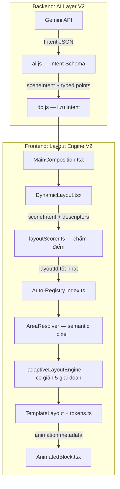

# Layout Engine V2 — Kế hoạch Nâng cấp Toàn diện

> **For Antigravity:** REQUIRED WORKFLOW: Use `.agent/workflows/execute-plan.md` to execute this plan in single-flow mode.

**Goal:** Nâng cấp hệ thống render layout video từ tập hợp các component React tĩnh (V1) thành một Layout Engine thực thụ, tự chọn layout thông minh và không phụ thuộc vào AI để quyết định giao diện cụ thể.

**Architecture:** 3 giai đoạn (Phase) triển khai độc lập theo lớp kiến trúc từ dưới lên: Data Contract → Engine Core → System Polish. Mỗi Phase hoàn chỉnh và có thể kiểm thử độc lập trước khi bắt đầu Phase tiếp theo.

**Tech Stack:** TypeScript, React, Remotion, Vite glob import, Node.js (backend), Gemini API (structured output)

---

## Bối cảnh & Động lực Nâng cấp

Hệ thống V1 hiện tại bộc lộ các điểm yếu nghiêm trọng khi scale:

| Vấn đề | Hậu quả |
|---|---|
| AI phải chọn đúng layout từ 100+ tên | Layout sai, overflow, AI hallucinate layout không tồn tại |
| Regex parser đoán kiểu block từ text | "30%" nhận diện đúng, "thirty percent" không nhận diện được |
| Collision resolver chỉ biết xóa block | Mất nội dung quan trọng chỉ vì thiếu 20px |
| Kích thước block hardcode (title=280px) | Tiêu đề 2 chữ và 30 chữ chiếm cùng chiều cao |
| 150+ layout import thủ công vào index.ts | File 1700+ dòng, conflict khi thêm layout mới |
| Design values hardcode trong từng JSON | Đổi radius toàn hệ thống = sửa hàng trăm file |
| Animation viết cứng trong component | Không thể tùy biến per-layout animation |

---

## Kiến trúc Tổng quan V2



---

## Phase 1: Data Contract — AI Schema & Scoring Engine

**Mục tiêu:** Tách AI hoàn toàn khỏi việc chọn layout. AI chỉ mô tả ý định cảnh. Layout Engine tự chọn.

**Files thay đổi:**
- Modify: `backend/services/ai.js`
- Modify: `backend/services/db.js`
- Modify: `backend/server.js`
- Create: `my-video/src/utils/layoutScorer.ts`
- Modify: `my-video/src/utils/layoutResolver.ts` (xóa regex parser)
- Modify: `my-video/src/compositions/layouts/DynamicLayout.tsx`

### Task 1.1: Định nghĩa Intent Schema mới cho AI

**Mô tả:** Thay `layoutFamily` + `visualLayout` bằng `sceneIntent` nhỏ gọn. Yêu cầu AI trả về typed points thay vì plain text.

**Schema V2 đầu ra của AI:**
```json
{
  "sceneIntent": {
    "type": "metric",
    "importance": "high",
    "density": "sparse",
    "emotion": "exciting"
  },
  "heading": "Tăng trưởng kỷ lục Q4",
  "points": [
    { "type": "metric",   "value": "+47%",      "label": "Doanh thu YoY"    },
    { "type": "card",     "text": "Mở rộng sang 3 thị trường mới"            },
    { "type": "terminal", "code": "npm install analytics-sdk"                }
  ],
  "voiceover": "Quý 4 ghi nhận mức tăng trưởng kỷ lục...",
  "duration": 8,
  "accentColor": "#FFB7C5",
  "theme": "dark"
}
```

**`type` của `sceneIntent` chỉ có 8 giá trị cố định:**
- `opening` | `comparison` | `metric` | `list` | `quote` | `timeline` | `media` | `ending`

**`type` của mỗi point item:**
- `metric` | `card` | `terminal` | `badge_row` | `logo_row` | `subheader` | `button`

**Step 1:** Cập nhật JSON Schema trong prompt của `ai.js` — xóa trường `layoutFamily`, `visualLayout`. Thêm `sceneIntent` object và yêu cầu mỗi point là object có `type`.

**Step 2:** Cập nhật phần `required` fields trong schema validation.

**Step 3:** Chạy thử với 1 request, kiểm tra output.
Expected: AI trả về `sceneIntent` thay vì `visualLayout`.

**Step 4:** Commit
```bash
git add backend/services/ai.js
git commit -m "feat(ai): replace visualLayout with intent-based schema v2"
```

---

### Task 1.2: Cập nhật DB Layer để lưu Intent

**Mô tả:** `db.js` hiện lưu `layout_family` + `visual_layout`. Thêm cột `scene_intent` (JSON blob) và `typed_points` (JSON blob thay thế cột `points` hiện tại).

**Step 1:** Cập nhật `CREATE TABLE` statement trong `db.js`:
```sql
-- Thêm cột mới (backward compatible — giữ cột cũ)
scene_intent TEXT,        -- JSON: { type, importance, density, emotion }
typed_points TEXT,        -- JSON: [{ type, value, text, label, ... }]
```

**Step 2:** Cập nhật hàm `insertScene` và `updateScene` để ghi `scene_intent` và `typed_points`.

**Step 3:** Cập nhật hàm `getScene` và `getScenes` để đọc và parse `scene_intent`.

**Step 4:** Cập nhật `server.js` để trả về `sceneIntent` trong API response thay cho `layoutFamily`/`visualLayout`.

**Step 5:** Commit
```bash
git add backend/services/db.js backend/server.js
git commit -m "feat(db): add scene_intent and typed_points columns"
```

---

### Task 1.3: Tạo Layout Scoring Engine

**Mô tả:** File mới `layoutScorer.ts` nhận `SceneIntent` + đặc điểm cảnh → trả về `layoutId` phù hợp nhất.

**File:** `my-video/src/utils/layoutScorer.ts`

```typescript
export interface SceneIntent {
  type: "opening" | "comparison" | "metric" | "list" | "quote" | "timeline" | "media" | "ending";
  importance: "high" | "medium" | "low";
  density: "dense" | "medium" | "sparse";
  emotion: "exciting" | "serious" | "informative" | "neutral";
}

export interface SceneDescriptors {
  pointCount: number;
  headingLength: number;   // chars
  hasImage: boolean;
  hasMetrics: boolean;     // có point type="metric" không
  hasTerminal: boolean;    // có point type="terminal" không
}

interface ScoredLayout {
  id: string;
  score: number;
}

export function scoreLayout(
  layoutId: string,
  layoutFamily: string,
  intent: SceneIntent,
  descriptors: SceneDescriptors
): number {
  let score = 0;

  // --- Type matching (base score)
  const familyMap: Record<string, string[]> = {
    opening:    ["opening"],
    comparison: ["comparison"],
    metric:     ["data"],
    list:       ["list"],
    quote:      ["quote"],
    timeline:   ["timeline"],
    media:      ["media"],
    ending:     ["ending"],
  };
  if (familyMap[intent.type]?.includes(layoutFamily)) score += 50;

  // --- Density penalties
  if (intent.density === "dense" && descriptors.pointCount > 4) score -= 30;
  if (intent.density === "sparse" && descriptors.pointCount < 2) score += 10;

  // --- Image presence
  if (descriptors.hasImage && layoutFamily === "media") score += 40;
  if (!descriptors.hasImage && layoutFamily === "media") score -= 40;

  // --- Heading length penalty for small title areas
  if (descriptors.headingLength > 40 && layoutFamily === "data") score -= 20;

  // --- Metric boost
  if (descriptors.hasMetrics && layoutFamily === "data") score += 30;

  // --- Importance boost for accent-heavy layouts
  if (intent.importance === "high") score += 15;

  return score;
}

export function selectBestLayout(
  intent: SceneIntent,
  descriptors: SceneDescriptors,
  registry: Record<string, { family: string }>
): string {
  const scored: ScoredLayout[] = Object.entries(registry).map(([id, meta]) => ({
    id,
    score: scoreLayout(id, meta.family, intent, descriptors)
  }));

  scored.sort((a, b) => b.score - a.score);
  return scored[0]?.id ?? "Hero"; // fallback
}
```

**Step 1:** Tạo file `layoutScorer.ts` với interface và logic trên.

**Step 2:** Viết unit tests cơ bản:
```
selectBestLayout({ type: "comparison" }, ...) → trả về một layout thuộc family "comparison"
selectBestLayout({ type: "metric", density: "sparse" }, ...) → trả về SingleStat hoặc GaugeStat
```

**Step 3:** Chạy tests. Expected: PASS.

**Step 4:** Cập nhật `DynamicLayout.tsx`: thay `getLayoutById(scene.visualLayout)` bằng:
```typescript
import { selectBestLayout } from "../../utils/layoutScorer";
const descriptors = {
  pointCount: points.length,
  headingLength: heading.length,
  hasImage: !!imageUrl,
  hasMetrics: points.some(p => p.type === "metric"),
  hasTerminal: points.some(p => p.type === "terminal"),
};
const layoutId = selectBestLayout(scene.sceneIntent, descriptors, LAYOUT_REGISTRY);
const layoutMeta = getLayoutById(layoutId);
```

**Step 5:** Commit
```bash
git add my-video/src/utils/layoutScorer.ts my-video/src/compositions/layouts/DynamicLayout.tsx
git commit -m "feat(engine): add layout scoring engine, decouple AI from layout selection"
```

---

### Task 1.4: Xóa Regex Parser — dùng Typed Points

**Mô tả:** Hàm `parseSceneToComponents` trong `layoutResolver.ts` hiện dùng regex để đoán kiểu block. Thay bằng mapper trực tiếp từ `point.type`.

**Step 1:** Cập nhật `parseSceneToComponents` để nhận `points` là mảng typed objects:
```typescript
export const parseSceneToComponents = (
  heading: string,
  points: Array<{ type: string; text?: string; value?: string; label?: string; code?: string; [key: string]: any }>,
  imageUrl: string,
  layoutType: string
): UIComponentDescriptor[] => {
  // Direct mapping từ type — không còn regex
  points.forEach((pt, idx) => {
    const delay = idx * 1.5;
    switch (pt.type) {
      case "metric":
        list.push({ id: `metric_${idx}`, type: "hero_metric", height: 260, priority: 90,
          data: { value: pt.value || "", subtext: pt.label || "", delay } });
        break;
      case "terminal":
        list.push({ id: `term_${idx}`, type: "terminal", height: 220, priority: 85,
          data: { code: pt.code || pt.text || "", delay } });
        break;
      case "card":
      default:
        list.push({ id: `card_${idx}`, type: "feature_card", height: 150, priority: 70,
          data: { text: pt.text || "", delay } });
    }
  });
  // ...
};
```

**Step 2:** Giữ lại regex fallback cho `string` type (backward compat với V1 data).

**Step 3:** Kiểm tra thủ công: Tạo một scene mới với `typed_points`, xem preview trong Remotion Studio.

**Step 4:** Commit
```bash
git add my-video/src/utils/layoutResolver.ts
git commit -m "feat(parser): replace regex heuristics with typed point mapping"
```

---

## Phase 2: Engine Core — Responsive Constraint & Semantic Layout

**Mục tiêu:** Thay Collision Resolver thô sơ bằng engine co giãn 5 giai đoạn. Chuyển JSON layout sang semantic areas.

**Files thay đổi:**
- Modify: `my-video/src/utils/layoutResolver.ts` (hàm `resolveLayoutConstraints`)
- Create: `my-video/src/utils/areaResolver.ts`
- Modify: `my-video/src/compositions/layouts/TemplateLayout.tsx`
- Modify: JSON templates (cập nhật dần — không bắt buộc ngay)

---

### Task 2.1: Adaptive Layout Engine (thay Collision Resolver)

**Mô tả:** Thay `resolveLayoutConstraints` bằng `adaptiveLayoutEngine` với pipeline 5 giai đoạn.

**File:** `my-video/src/utils/layoutResolver.ts`

**Interface mới:**
```typescript
export interface AdaptiveLayoutResult {
  components: UIComponentDescriptor[];
  fontScale: number;      // 0.75 – 1.0
  paddingScale: number;   // 0.5 – 1.0
  gap: number;            // 15 – 50px
  pages: UIComponentDescriptor[][];
}

export const adaptiveLayoutEngine = (
  components: UIComponentDescriptor[],
  maxHeight: number = 1600,
): AdaptiveLayoutResult
```

**Logic pipeline:**
```typescript
// Stage 1: Font scale reduction (1.0 → 0.75, step 0.05)
// Stage 2: Padding scale reduction (1.0 → 0.5, step 0.1)
// Stage 3: Gap reduction (50 → 30 → 15)
// Stage 4: Paginate (split into pages of 3 items each)
// Stage 5: Drop lowest priority (same as V1, last resort only)
```

**Hàm ước tính chiều cao dựa trên nội dung:**
```typescript
export function estimateComponentHeight(
  comp: UIComponentDescriptor,
  fontScale: number = 1.0
): number {
  switch (comp.type) {
    case "title": {
      const chars = (comp.data.text || "").length;
      const lines = Math.ceil(chars / 20);
      return Math.max(120, lines * 80 * fontScale);
    }
    case "feature_card": {
      const chars = (comp.data.text || "").length;
      const lines = Math.ceil(chars / 35);
      return Math.max(80, lines * 52 * fontScale);
    }
    case "hero_metric": return Math.round(240 * fontScale);
    case "terminal":    return Math.round(200 * fontScale);
    case "subheader":   return Math.round(90 * fontScale);
    case "badge_row":   return Math.round(110 * fontScale);
    case "button":      return Math.round(110 * fontScale);
    default:            return Math.round(150 * fontScale);
  }
}
```

**Step 1:** Thêm `estimateComponentHeight` vào `layoutResolver.ts`.

**Step 2:** Implement `adaptiveLayoutEngine` với pipeline 5 giai đoạn.

**Step 3:** Giữ lại `resolveLayoutConstraints` cũ (deprecated, dùng khi V2 flag off).

**Step 4:** Cập nhật `DynamicLayout.tsx` dùng `adaptiveLayoutEngine` thay `resolveLayoutConstraints`.

**Step 5:** Cập nhật render để nhận `fontScale` và `paddingScale` từ result và pass xuống `TemplateLayout`.

**Step 6:** Kiểm tra thủ công: Tạo scene với 8+ points, xem engine co giãn không xóa ngay.

**Step 7:** Commit
```bash
git add my-video/src/utils/layoutResolver.ts my-video/src/compositions/layouts/DynamicLayout.tsx
git commit -m "feat(engine): replace collision resolver with 5-stage adaptive layout engine"
```

---

### Task 2.2: Area Resolver — Semantic Layout Support

**Mô tả:** Tạo `areaResolver.ts` dịch từ semantic area slots sang pixel coordinates.

**File:** `my-video/src/utils/areaResolver.ts`

```typescript
export type AreaSlot = "top" | "middle" | "bottom-safe" | "full";
export type HeightHint = "large" | "fill" | "compact" | "auto";
export type LayoutMode = "center" | "left" | "right" | "stack";

export interface SemanticArea {
  slot: AreaSlot;
  heightHint: HeightHint;
  layout: LayoutMode;
  padding?: string;  // token reference: "sm" | "md" | "lg"
}

export interface ResolvedArea {
  top: number;
  left: number;
  width: number;
  height: number;
  flexDirection?: "row" | "column";
  justifyContent?: string;
  alignItems?: string;
}

const SLOT_PERCENTAGES: Record<AreaSlot, [number, number]> = {
  "top":         [0.0,  0.30],
  "middle":      [0.30, 0.75],
  "bottom-safe": [0.75, 1.0],
  "full":        [0.0,  1.0],
};

export function resolveArea(
  area: SemanticArea,
  canvasWidth: number,
  canvasHeight: number
): ResolvedArea {
  const [startFrac, endFrac] = SLOT_PERCENTAGES[area.slot];
  const topPx    = canvasHeight * startFrac;
  const heightPx = canvasHeight * (endFrac - startFrac);

  return {
    top:    Math.round(topPx),
    left:   0,
    width:  canvasWidth,
    height: Math.round(heightPx),
  };
}

// Compatibility adapter: convert V1 positions[] to semantic areas
export function adaptV1Positions(positions: any[]): SemanticArea[] {
  return positions.map((pos, idx) => ({
    slot: idx === 0 ? "top" : idx === positions.length - 1 ? "bottom-safe" : "middle",
    heightHint: "auto",
    layout: "left",
  }));
}
```

**Step 1:** Tạo file `areaResolver.ts` với logic trên.

**Step 2:** Cập nhật `TemplateLayout.tsx`: thêm nhánh xử lý `t.areas` (V2 JSON). Nếu không có `t.areas`, fallback về `t.positions` qua `adaptV1Positions`.

**Step 3:** Thêm section `areas` vào 3 JSON templates thử nghiệm (Hero, SingleStat, Pullquote).

**Step 4:** Kiểm tra preview 3 layouts đã migrate.

**Step 5:** Commit
```bash
git add my-video/src/utils/areaResolver.ts my-video/src/compositions/layouts/TemplateLayout.tsx
git commit -m "feat(engine): add semantic area resolver with V1 compatibility adapter"
```

---

## Phase 3: System Polish — Tokens, Auto-registry, Animation

**Mục tiêu:** Nhất quán hóa toàn hệ thống. Thêm một layout mới chỉ cần tạo JSON.

**Files thay đổi:**
- Create: `my-video/src/styles/tokens.ts`
- Modify: `my-video/src/compositions/layouts/index.ts` (xóa manual imports)
- Modify: `my-video/src/compositions/layouts/TemplateLayout.tsx` (đọc token)
- Modify: `my-video/src/components/layout/AnimatedBlock.tsx`

---

### Task 3.1: Design Tokens tập trung

**Mô tả:** Tạo file tokens tập trung, cập nhật `TemplateLayout` đọc token thay hardcode.

**File:** `my-video/src/styles/tokens.ts`

```typescript
export const tokens = {
  spacing: {
    xs: 8, sm: 16, md: 24, lg: 32, xl: 48, "2xl": 64, "3xl": 86
  } as Record<string, number>,

  radius: {
    sm: 12, md: 20, lg: 30, xl: 40, pill: 999
  } as Record<string, number>,

  typography: {
    "title-xl": { fontSize: 86, fontWeight: 900, letterSpacing: "-0.04em" },
    "title-lg": { fontSize: 72, fontWeight: 800, letterSpacing: "-0.03em" },
    "title-md": { fontSize: 60, fontWeight: 800, letterSpacing: "-0.02em" },
    "card-xl":  { fontSize: 36, fontWeight: 800 },
    "card-lg":  { fontSize: 32, fontWeight: 800 },
    "card-md":  { fontSize: 28, fontWeight: 700 },
    "card-sm":  { fontSize: 22, fontWeight: 700 },
    "badge":    { fontSize: 14, fontWeight: 900, letterSpacing: "0.2em" },
    "caption":  { fontSize: 18, fontWeight: 600 },
  } as Record<string, { fontSize: number; fontWeight: number; letterSpacing?: string }>,
} as const;

export function resolveToken(key: string | number, tokenMap: Record<string, number>): number {
  if (typeof key === "number") return key;
  return tokenMap[key] ?? parseInt(key) ?? 0;
}
```

**Step 1:** Tạo file `tokens.ts`.

**Step 2:** Cập nhật `TemplateLayout.tsx` import và dùng `tokens.radius`, `tokens.typography` khi render itemStyles (nếu value là token name thay vì pixel string).

**Step 3:** Cập nhật 5 JSON templates thử nghiệm dùng token references:
```json
// Trước
{ "fontSize": "28px", "borderRadius": "30px" }
// Sau  
{ "typography": "card-md", "radius": "lg" }
```

**Step 4:** Kiểm tra 5 layouts vẫn hiển thị đúng.

**Step 5:** Commit
```bash
git add my-video/src/styles/tokens.ts my-video/src/compositions/layouts/TemplateLayout.tsx
git commit -m "feat(tokens): add centralized design tokens, resolve token references in TemplateLayout"
```

---

### Task 3.2: Auto-registration via Vite Glob Import

**Mô tả:** Xóa toàn bộ 150+ dòng import thủ công. Dùng `import.meta.glob` để tự động scan thư mục templates.

**File:** `my-video/src/compositions/layouts/index.ts`

**Step 1:** Thêm auto-registry logic vào đầu file:
```typescript
import React from "react";
import { LayoutProps } from "./LayoutTypes";
import { TemplateLayout } from "./TemplateLayout";

// Auto-scan tất cả JSON trong thư mục templates
const templateModules = import.meta.glob('./templates/**/*.json', { eager: true });

export const LAYOUT_REGISTRY: Record<string, LayoutMetadata> = {};

for (const [_path, module] of Object.entries(templateModules)) {
  const json = (module as any).default ?? module;
  if (!json?.id) continue;
  LAYOUT_REGISTRY[json.id] = {
    id: json.id,
    name: json.name || json.id,
    family: json.family || "opening",
    component: (props: LayoutProps) =>
      React.createElement(TemplateLayout, { ...props, templateJson: json }),
    templateJson: json,
    description: json.description || `Layout: ${json.name}`,
  };
}
```

**Step 2:** Xóa toàn bộ các dòng `import xxxJson from "./templates/..."` thủ công (150+ dòng).

**Step 3:** Giữ lại `getLayoutById` và các export types — chúng không thay đổi.

**Step 4:** Build thử: `npm run build` trong `my-video/`
Expected: Build thành công, không có lỗi import.

**Step 5:** Kiểm tra tổng số layouts được đăng ký:
```typescript
console.log(Object.keys(LAYOUT_REGISTRY).length); // Phải >= 100
```

**Step 6:** Commit
```bash
git add my-video/src/compositions/layouts/index.ts
git commit -m "feat(registry): replace 150+ manual imports with Vite glob auto-registry"
```

---

### Task 3.3: Animation Metadata trong JSON Layout

**Mô tả:** Thêm section `animations` vào JSON schema. Cập nhật `AnimatedBlock` đọc từ metadata.

**Cập nhật JSON schema (optional field, backward compatible):**
```json
{
  "id": "HeroMetricCards",
  "animations": {
    "sceneEnter": {
      "type": "fade-up",
      "duration": 0.6,
      "easing": "spring"
    },
    "itemStagger": {
      "type": "slide-up",
      "baseDelay": 0.3,
      "staggerDelay": 0.15
    },
    "sceneExit": {
      "type": "fade-out",
      "duration": 0.4
    }
  }
}
```

**Cập nhật `DynamicLayout.tsx`:** Pass `layoutMeta.templateJson?.animations` xuống `renderComponent`:
```typescript
const animMeta = layoutMeta.templateJson?.animations?.itemStagger;
const delay = animMeta
  ? animMeta.baseDelay + idx * animMeta.staggerDelay
  : idx * 1.5;
const animation = animMeta?.type ?? comp.data.animation ?? "slide-up";
```

**Fallback:** Nếu JSON không có `animations`, dùng hardcoded default (`slide-up`, delay=0.5s).

**Step 1:** Thêm `animations` vào 5 JSON templates thử nghiệm.

**Step 2:** Cập nhật `DynamicLayout.tsx` đọc animation metadata.

**Step 3:** Kiểm tra trong Remotion Studio: 5 layouts có animation theo đúng cấu hình JSON.

**Step 4:** Commit
```bash
git add my-video/src/compositions/layouts/DynamicLayout.tsx
git commit -m "feat(animation): read animation metadata from layout JSON, keep fallback for V1"
```

---

## Tổng kết & Thứ tự Commit

```
Phase 1:
  feat(ai): replace visualLayout with intent-based schema v2
  feat(db): add scene_intent and typed_points columns
  feat(engine): add layout scoring engine, decouple AI from layout selection
  feat(parser): replace regex heuristics with typed point mapping

Phase 2:
  feat(engine): replace collision resolver with 5-stage adaptive layout engine
  feat(engine): add semantic area resolver with V1 compatibility adapter

Phase 3:
  feat(tokens): add centralized design tokens
  feat(registry): replace 150+ manual imports with Vite glob auto-registry
  feat(animation): read animation metadata from layout JSON
```

## Xác minh Hoàn thành (Verification Criteria)

| Tiêu chí | Cách kiểm tra |
|---|---|
| AI không còn trả `visualLayout` | Log AI output, không thấy trường `visualLayout` |
| Scene 8 cards không bị overflow | Remotion Studio, xem adaptive engine co font/gap |
| Thêm JSON mới = tự động đăng ký | Tạo `test_layout.json`, load Studio, layout xuất hiện |
| Đổi 1 token = đổi toàn hệ thống | Thay `radius.lg = 30` → `24`, reload, tất cả cards đổi radius |
| `index.ts` < 100 dòng | `wc -l index.ts` |
