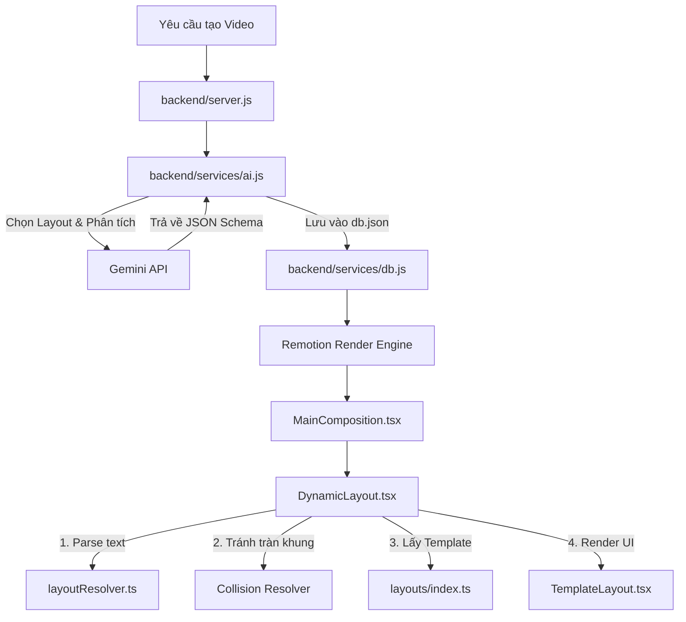

# Tài liệu Thiết kế Ghi lại Hệ thống Sinh Layout Video Tự động (Video Layout Generation Design)

Hệ thống sinh layout tự động cho phép biến đổi các kịch bản văn bản thô được AI tạo ra thành các video có cấu trúc giao diện đẹp mắt, linh hoạt, và chống tràn nội dung (overflow prevention) trên màn hình thiết bị di động giả lập.

---

## 1. Kiến trúc Tổng quan & Luồng Xử lý (Architectural Pipeline)

Quy trình hoạt động từ lúc người dùng yêu cầu tạo video đến khi Remotion render giao diện thực tế trải qua 3 giai đoạn chính:



### Chi tiết các bước trong luồng:

1. **Giai đoạn 1: Gợi ý và lựa chọn Layout bằng AI (Backend)**
   - Lớp dịch vụ trí tuệ nhân tạo [ai.js](file:///c:/Users/nghia/OneDrive/M%C3%A1y%20t%C3%ADnh/AI-grenerated%20vid-hyperframe/backend/services/ai.js) sử dụng Gemini API với prompt chi tiết để sinh kịch bản video theo định dạng JSON có cấu trúc.
   - Đối với mỗi Scene (cảnh), AI lựa chọn một nhóm layout (`layoutFamily`) và một kiểu layout trực quan (`visualLayout`) từ danh sách hơn 100 layouts định sẵn sao cho phù hợp nhất với nội dung cảnh.
   - Dữ liệu scene sau đó được lưu trữ vào cơ sở dữ liệu `db.json` thông qua [db.js](file:///c:/Users/nghia/OneDrive/M%C3%A1y%20t%C3%ADnh/AI-grenerated%20vid-hyperframe/backend/services/db.js).

2. **Giai đoạn 2: API cung cấp dữ liệu**
   - Khi có yêu cầu biên dịch hoặc xem trước (preview) video, backend server [server.js](file:///c:/Users/nghia/OneDrive/M%C3%A1y%20t%C3%ADnh/AI-grenerated%20vid-hyperframe/backend/server.js) trả về cấu hình chi tiết của project chứa toàn bộ các scenes cùng thông tin layout và đường dẫn hình ảnh nền.

3. **Giai đoạn 3: Phân tích và Dựng hình động (Frontend - Remotion)**
   - Component [MainComposition.tsx](file:///c:/Users/nghia/OneDrive/M%C3%A1y%20t%C3%ADnh/AI-grenerated%20vid-hyperframe/my-video/src/compositions/MainComposition.tsx) chuyển tiếp các thuộc tính của scene vào component điều phối layout động: [DynamicLayout.tsx](file:///c:/Users/nghia/OneDrive/M%C3%A1y%20t%C3%ADnh/AI-grenerated%20vid-hyperframe/my-video/src/compositions/layouts/DynamicLayout.tsx).
   - [DynamicLayout.tsx](file:///c:/Users/nghia/OneDrive/M%C3%A1y%20t%C3%ADnh/AI-grenerated%20vid-hyperframe/my-video/src/compositions/layouts/DynamicLayout.tsx) gọi bộ phân tích cú pháp để bóc tách danh sách văn bản thô thành các khối giao diện UI riêng lẻ, giải quyết ràng buộc chiều cao chống tràn khung, tra cứu cấu hình khung xương JSON tương ứng và tiến hành vẽ lên màn hình thông qua [TemplateLayout.tsx](file:///c:/Users/nghia/OneDrive/M%C3%A1y%20t%C3%ADnh/AI-grenerated%20vid-hyperframe/my-video/src/compositions/layouts/TemplateLayout.tsx).

---

## 2. Chi tiết Kỹ thuật & Thuật toán Xử lý Giao diện Động

### 2.1 Bộ Phân tích Cú pháp Scene ([layoutResolver.ts](file:///c:/Users/nghia/OneDrive/M%C3%A1y%20t%C3%ADnh/AI-grenerated%20vid-hyperframe/my-video/src/utils/layoutResolver.ts))

Hàm `parseSceneToComponents` thực hiện quét tiêu đề (`heading`), danh sách các bullet point (`points`) và nhận diện mẫu (pattern-matching) để phân loại thành các thành phần giao diện chuyên biệt:
* **Tiêu đề (`title`)**: Luôn được khởi tạo ở đầu danh sách với độ ưu tiên cao nhất (`priority` = 100) để đảm bảo không bao giờ bị ẩn đi.
* **Khung lệnh Terminal (`terminal`)**: Tự động kích hoạt khi dòng văn bản bắt đầu bằng dấu đô-la (`$`) hoặc chứa các từ khóa kỹ thuật như `npm install`, `pip install`, `git clone`, `curl `.
* **Dòng Nhãn nổi bật (`badge_row`)**: Tự động kích hoạt khi dòng chứa dấu phẩy phân tách các nhãn ngắn có chứa các ký tự đặc biệt/emoji như `⭐`, `🔥`, `sao`, `MIT`.
* **Khối Chỉ số lớn (`hero_metric`)**: Nhận diện khi chuỗi bắt đầu bằng dấu cộng/trừ hoặc kết thúc bằng ký tự phần trăm `%`. Hệ thống sẽ tự động tách số liệu nổi bật và nhãn mô tả phụ (dựa trên cặp ngoặc đơn `()` hoặc dấu gạch ngang `—`).
* **Khối thẻ thông tin (`feature_card`)**: Là kiểu mặc định cho các dòng văn bản mô tả thông thường.
* **Direct JSON mapping**: Nếu dữ liệu đầu vào là các Object có sẵn thuộc tính `type` từ AI, hệ thống sẽ ánh xạ trực tiếp sang các thành phần cụ thể như `logo_row`, `subheader`, `button`, v.v.

### 2.2 Thuật toán Giải quyết Va chạm & Chống tràn khung ([layoutResolver.ts](file:///c:/Users/nghia/OneDrive/M%C3%A1y%20t%C3%ADnh/AI-grenerated%20vid-hyperframe/my-video/src/utils/layoutResolver.ts))

Khi hiển thị video dạng dọc (Portrait) giả lập màn hình điện thoại, không gian chiều dọc cực kỳ hạn chế. Để tránh việc nội dung dài vượt quá mép dưới màn hình, thuật toán `resolveLayoutConstraints` được áp dụng:

1. **Gán kích thước và độ ưu tiên mặc định:**
   * `title`: Chiều cao 280px, Độ ưu tiên 100.
   * `subheader`: Chiều cao 100px, Độ ưu tiên 95.
   * `hero_metric`: Chiều cao 260px, Độ ưu tiên 90.
   * `terminal`: Chiều cao 220px, Độ ưu tiên 85.
   * `feature_card`: Chiều cao 150px, Độ ưu tiên 70.
   * `badge_row`: Chiều cao 130px, Độ ưu tiên 50.
   * `button`: Chiều cao 130px, Độ ưu tiên 65.
   
2. **Tính toán tổng chiều cao:**
   * Công thức: $\text{Tổng chiều cao} = \sum(\text{Chiều cao Component}) + (\text{Số lượng} - 1) \times \text{Khoảng cách (Gap)}$.
   * Ngưỡng giới hạn mặc định là `maxHeight = 1600px` (với khoảng cách giữa các khối `gap = 50px`).

3. **Vòng lặp loại bỏ thông tin thừa:**
   * Nếu Tổng chiều cao vượt ngưỡng `maxHeight`, thuật toán sẽ tìm kiếm trong danh sách các component hiện tại thành phần nào có **độ ưu tiên thấp nhất** (`priority` thấp nhất).
   * Loại bỏ thành phần đó ra khỏi danh sách hiển thị và tính toán lại tổng chiều cao.
   * Lặp lại cho đến khi tổng chiều cao đảm bảo nhỏ hơn hoặc bằng `maxHeight`.

### 2.3 Cơ chế Tạo Style và Áp dụng Theme Động ([TemplateLayout.tsx](file:///c:/Users/nghia/OneDrive/M%C3%A1y%20t%C3%ADnh/AI-grenerated%20vid-hyperframe/my-video/src/compositions/layouts/TemplateLayout.tsx))

* **Theme styles**: `TemplateLayout` lấy cấu hình CSS cơ sở thông qua theme được chỉ định (hoặc ghi đè bởi `visualStyle`).
* **Accent color blend**: Biến đổi mã màu Hex (ví dụ `#FFB7C5`) sang hệ RGB để tính toán dải màu tối hơn (`darkAccentColor`) bằng cách nhân độ sáng với tỉ lệ tương ứng (75% cho các theme sáng như `claude`/`light` và 45% cho theme tối) giúp tạo hiệu ứng gradient 3D mượt mà cho thẻ.
* **Luminance accessibility**: Kiểm tra độ sáng (Luminance) của accent color gốc qua công thức:
  $$Y = 0.299 \times R + 0.587 \times G + 0.114 \times B$$
  Nếu $Y > 180$, accent color được coi là màu sáng. Hệ thống sẽ tự động chuyển màu chữ trên nền accent color sang màu tối (`#111111`) thay vì trắng (`#ffffff`) để bảo đảm độ tương phản rõ ràng.

---

## 3. Danh mục Phân loại Visual Layouts

Các layouts trong dự án được tổ chức và đăng ký tại [index.ts](file:///c:/Users/nghia/OneDrive/M%C3%A1y%20t%C3%ADnh/AI-grenerated%20vid-hyperframe/my-video/src/compositions/layouts/index.ts). Hệ thống chia chúng làm các nhóm chính (`layoutFamily`):

| Layout Family | Mục đích Sử dụng | Visual Layouts Đặc trưng |
| :--- | :--- | :--- |
| **Opening / Headline (`opening`)** | Khởi động video, giới thiệu tiêu đề lớn, thông tin tác giả. | `IntroProfile`, `Hero`, `AppCardConcept`, `BroadcastLowerThirdTitle`, `WalkthroughPhoneExample`. |
| **Points / List (`list`)** | Liệt kê các tính năng, tài liệu tham khảo, các bước quy trình. | `AuditTrailChecklist`, `KanbanChecklist`, `DossierProofBullet`, `SwitchboardRadio`, `SocialPost`. |
| **Data / Metrics (`data`)** | Nhấn mạnh vào số liệu kỹ thuật tăng trưởng hoặc bảng dữ liệu. | `HeroMetricCards`, `GaugeStat`, `ProgressBars`, `SingleStat`, `RadialMetricCards`. |
| **Comparison (`comparison`)** | So sánh trực quan giữa hai tùy chọn, đối mặt hoặc ưu/nhược điểm. | `VersusScale`, `VersusArena`, `NeonPlanVersus`, `ComparisonBoard`, `SplitScreenInterview`. |
| **Quote / Text (`quote`)** | Trích dẫn câu nói hay, thông tin hội thoại mạng xã hội, ý kiến chuyên gia. | `Pullquote`, `ConversationQuote`, `VignelliQuote`, `MessageQuote`. |
| **Timeline (`timeline`)** | Biểu diễn lộ trình phát triển hoặc các cột mốc quan trọng theo thời gian. | `TimelineStaircase`, `TimelineRoadmap`, `TimelineRadar`, `TimelineNewswire`. |
| **Media (`media`)** | Tập trung làm nổi bật ảnh chụp màn hình, ảnh chụp thực tế hoặc video nền. | `SplitScreen`, `ImageBackgroundDefault`, `MediaCard`, `MediaImageFocusWindow`. |
| **Ending (`ending`)** | Chứa thông điệp kêu gọi hành động (CTA), thông tin liên hệ, logo thương hiệu. | `BrandOutro`, `ContactCardEnding`, `SocialFollowEnding`, `Subscribe`, `Minimal`. |

---

## 4. Hướng dẫn Lập trình viên: Thêm mới một Visual Layout

Khi muốn thiết kế và tích hợp thêm một layout mới vào hệ thống, thực hiện đầy đủ 3 bước sau:

### Bước 1: Thiết lập tệp cấu hình JSON Template
Tạo một tệp JSON mới trong thư mục con tương ứng tại `my-video/src/compositions/layouts/templates/` (Ví dụ: `my-video/src/compositions/layouts/templates/Opening-Headline/my_new_title.json`):
```json
{
  "id": "MyNewTitle",
  "name": "My New Title Layout",
  "family": "opening",
  "layoutMode": "absolute_cards",
  "container": {
    "paddingTop": "200px"
  },
  "title": {
    "fontSize": "86px",
    "fontWeight": "900",
    "marginBottom": "120px"
  },
  "positions": [
    { "left": "0px", "top": "0px", "width": "100%", "height": "160px", "zIndex": "1" }
  ],
  "items": {
    "rotations": [0.0],
    "itemStyles": [
      {
        "v2": true,
        "fontSize": "30px",
        "borderRadius": "24px",
        "padding": "20px 24px",
        "useAccentBg": true
      }
    ]
  }
}
```

### Bước 2: Đăng ký Layout vào Registry ở Frontend
Mở tệp [index.ts](file:///c:/Users/nghia/OneDrive/M%C3%A1y%20t%C3%ADnh/AI-grenerated%20vid-hyperframe/my-video/src/compositions/layouts/index.ts):
1. Import tệp JSON cấu hình vừa tạo ở trên:
   ```typescript
   import myNewTitleJson from "./templates/Opening-Headline/my_new_title.json";
   ```
2. Đăng ký layout vào đối tượng `LAYOUT_REGISTRY`:
   ```typescript
   export const LAYOUT_REGISTRY: Record<string, LayoutMetadata> = {
     // ... các layout khác ...
     MyNewTitle: {
       id: "MyNewTitle",
       name: "My New Title",
       family: "opening",
       component: (props) => React.createElement(TemplateLayout, { ...props, templateJson: myNewTitleJson }),
       templateJson: myNewTitleJson,
       description: "Khung xương layout dạng Card tiêu đề phong cách hiện đại mới."
     },
   };
   ```

### Bước 3: Đăng ký Layout vào Gợi ý Prompt ở Backend
Mở tệp [ai.js](file:///c:/Users/nghia/OneDrive/M%C3%A1y%20t%C3%ADnh/AI-grenerated%20vid-hyperframe/backend/services/ai.js):
1. Thêm ID layout mới (`"MyNewTitle"`) vào kiểu dữ liệu được chấp nhận cho trường `visualLayout` trong mô tả JSON schema gửi tới Gemini:
   ```javascript
   "visualLayout": "AppCardConcept" | "AppShowcaseTitle" | ... | "MyNewTitle"
   ```
2. Thêm mô tả hướng dẫn chọn layout tương thích trong phần `Layout selection guide` để AI hiểu khi nào nên ưu tiên chọn layout này.
