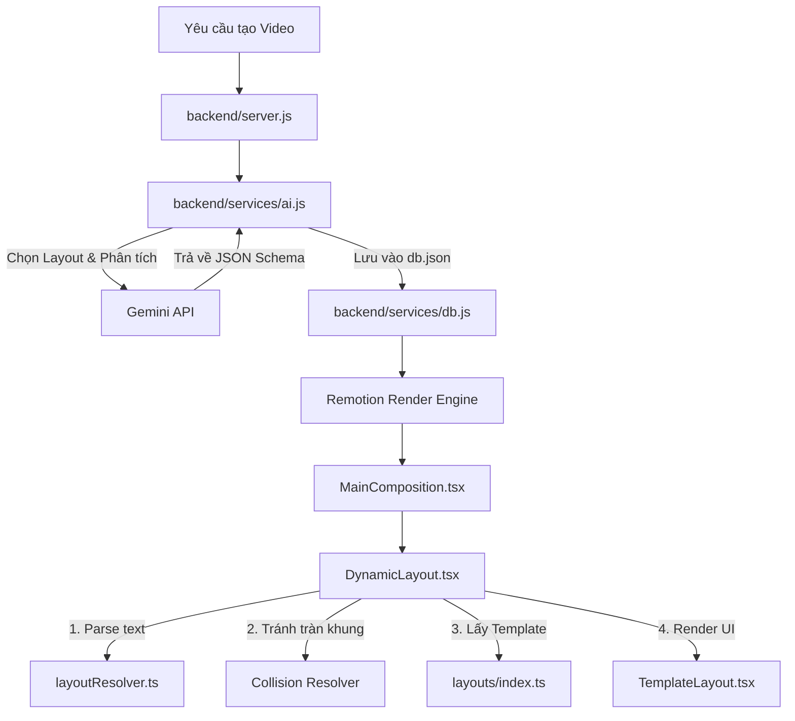
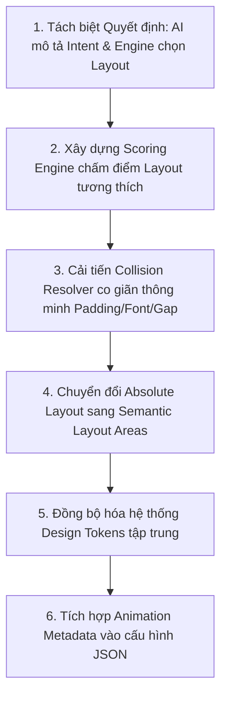

# Tài liệu Thiết kế Ghi lại Hệ thống Sinh Layout Video Tự động (Video Layout Generation Design)

Hệ thống sinh layout tự động cho phép biến đổi các kịch bản văn bản thô được AI tạo ra thành các video có cấu trúc giao diện đẹp mắt, linh hoạt, và chống tràn nội dung (overflow prevention) trên màn hình thiết bị di động giả lập.

---

## 1. Kiến trúc Tổng quan & Luồng Xử lý (Architectural Pipeline)

Quy trình hoạt động từ lúc người dùng yêu cầu tạo video đến khi Remotion render giao diện thực tế trải qua 3 giai đoạn chính:



### Chi tiết các bước trong luồng:

1. **Giai đoạn 1: Gợi ý và lựa chọn Layout bằng AI (Backend)**
   - Lớp dịch vụ trí tuệ nhân tạo [ai.js](file:///c:/Users/nghia/OneDrive/M%C3%A1y%20t%C3%ADnh/AI-grenerated%20vid-hyperframe/backend/services/ai.js) sử dụng Gemini API với prompt chi tiết để sinh kịch bản video theo định dạng JSON có cấu trúc.
   - Đối với mỗi Scene (cảnh), AI lựa chọn một nhóm layout (`layoutFamily`) và một kiểu layout trực quan (`visualLayout`) từ danh sách hơn 100 layouts định sẵn sao cho phù hợp nhất với nội dung cảnh.
   - Dữ liệu scene sau đó được lưu trữ vào cơ sở dữ liệu `db.json` thông qua [db.js](file:///c:/Users/nghia/OneDrive/M%C3%A1y%20t%C3%ADnh/AI-grenerated%20vid-hyperframe/backend/services/db.js).

2. **Giai đoạn 2: API cung cấp dữ liệu**
   - Khi có yêu cầu biên dịch hoặc xem trước (preview) video, backend server [server.js](file:///c:/Users/nghia/OneDrive/M%C3%A1y%20t%C3%ADnh/AI-grenerated%20vid-hyperframe/backend/server.js) trả về cấu hình chi tiết của project chứa toàn bộ các scenes cùng thông tin layout và đường dẫn hình ảnh nền.

3. **Giai đoạn 3: Phân tích và Dựng hình động (Frontend - Remotion)**
   - Component [MainComposition.tsx](file:///c:/Users/nghia/OneDrive/M%C3%A1y%20t%C3%ADnh/AI-grenerated%20vid-hyperframe/my-video/src/compositions/MainComposition.tsx) chuyển tiếp các thuộc tính của scene vào component điều phối layout động: [DynamicLayout.tsx](file:///c:/Users/nghia/OneDrive/M%C3%A1y%20t%C3%ADnh/AI-grenerated%20vid-hyperframe/my-video/src/compositions/layouts/DynamicLayout.tsx).
   - [DynamicLayout.tsx](file:///c:/Users/nghia/OneDrive/M%C3%A1y%20t%C3%ADnh/AI-grenerated%20vid-hyperframe/my-video/src/compositions/layouts/DynamicLayout.tsx) gọi bộ phân tích cú pháp để bóc tách danh sách văn bản thô thành các khối giao diện UI riêng lẻ, giải quyết ràng buộc chiều cao chống tràn khung, tra cứu cấu hình khung xương JSON tương ứng và tiến hành vẽ lên màn hình thông qua [TemplateLayout.tsx](file:///c:/Users/nghia/OneDrive/M%C3%A1y%20t%C3%ADnh/AI-grenerated%20vid-hyperframe/my-video/src/compositions/layouts/TemplateLayout.tsx).

---

## 2. Chi tiết Kỹ thuật & Thuật toán Xử lý Giao diện Động

### 2.1 Bộ Phân tích Cú pháp Scene ([layoutResolver.ts](file:///c:/Users/nghia/OneDrive/M%C3%A1y%20t%C3%ADnh/AI-grenerated%20vid-hyperframe/my-video/src/utils/layoutResolver.ts))

Hàm `parseSceneToComponents` thực hiện quét tiêu đề (`heading`), danh sách các bullet point (`points`) và nhận diện mẫu (pattern-matching) để phân loại thành các thành phần giao diện chuyên biệt:
* **Tiêu đề (`title`)**: Luôn được khởi tạo ở đầu danh sách với độ ưu tiên cao nhất (`priority` = 100) để đảm bảo không bao giờ bị ẩn đi.
* **Khung lệnh Terminal (`terminal`)**: Tự động kích hoạt khi dòng văn bản bắt đầu bằng dấu đô-la (`$`) hoặc chứa các từ khóa kỹ thuật như `npm install`, `pip install`, `git clone`, `curl `.
* **Dòng Nhãn nổi bật (`badge_row`)**: Tự động kích hoạt khi dòng chứa dấu phẩy phân tách các nhãn ngắn có chứa các ký tự đặc biệt/emoji như `⭐`, `🔥`, `sao`, `MIT`.
* **Khối Chỉ số lớn (`hero_metric`)**: Nhận diện khi chuỗi bắt đầu bằng dấu cộng/trừ hoặc kết thúc bằng ký tự phần trăm `%`. Hệ thống sẽ tự động tách số liệu nổi bật và nhãn mô tả phụ (dựa trên cặp ngoặc đơn `()` hoặc dấu gạch ngang `—`).
* **Khối thẻ thông tin (`feature_card`)**: Là kiểu mặc định cho các dòng văn bản mô tả thông thường.
* **Direct JSON mapping**: Nếu dữ liệu đầu vào là các Object có sẵn thuộc tính `type` từ AI, hệ thống sẽ ánh xạ trực tiếp sang các thành phần cụ thể như `logo_row`, `subheader`, `button`, v.v.

### 2.2 Thuật toán Giải quyết Va chạm & Chống tràn khung ([layoutResolver.ts](file:///c:/Users/nghia/OneDrive/M%C3%A1y%20t%C3%ADnh/AI-grenerated%20vid-hyperframe/my-video/src/utils/layoutResolver.ts))

Khi hiển thị video dạng dọc (Portrait) giả lập màn hình điện thoại, không gian chiều dọc cực kỳ hạn chế. Để tránh việc nội dung dài vượt quá mép dưới màn hình, thuật toán `resolveLayoutConstraints` được áp dụng:

1. **Gán kích thước và độ ưu tiên mặc định:**
   * `title`: Chiều cao 280px, Độ ưu tiên 100.
   * `subheader`: Chiều cao 100px, Độ ưu tiên 95.
   * `hero_metric`: Chiều cao 260px, Độ ưu tiên 90.
   * `terminal`: Chiều cao 220px, Độ ưu tiên 85.
   * `feature_card`: Chiều cao 150px, Độ ưu tiên 70.
   * `badge_row`: Chiều cao 130px, Độ ưu tiên 50.
   * `button`: Chiều cao 130px, Độ ưu tiên 65.
   
2. **Tính toán tổng chiều cao:**
   * Công thức: $\text{Tổng chiều cao} = \sum(\text{Chiều cao Component}) + (\text{Số lượng} - 1) \times \text{Khoảng cách (Gap)}$.
   * Ngưỡng giới hạn mặc định là `maxHeight = 1600px` (với khoảng cách giữa các khối `gap = 50px`).

3. **Vòng lặp loại bỏ thông tin thừa:**
   * Nếu Tổng chiều cao vượt ngưỡng `maxHeight`, thuật toán sẽ tìm kiếm trong danh sách các component hiện tại thành phần nào có **độ ưu tiên thấp nhất** (`priority` thấp nhất).
   * Loại bỏ thành phần đó ra khỏi danh sách hiển thị và tính toán lại tổng chiều cao.
   * Lặp lại cho đến khi tổng chiều cao đảm bảo nhỏ hơn hoặc bằng `maxHeight`.

### 2.3 Cơ chế Tạo Style và Áp dụng Theme Động ([TemplateLayout.tsx](file:///c:/Users/nghia/OneDrive/M%C3%A1y%20t%C3%ADnh/AI-grenerated%20vid-hyperframe/my-video/src/compositions/layouts/TemplateLayout.tsx))

* **Theme styles**: `TemplateLayout` lấy cấu hình CSS cơ sở thông qua theme được chỉ định (hoặc ghi đè bởi `visualStyle`).
* **Accent color blend**: Biến đổi mã màu Hex (ví dụ `#FFB7C5`) sang hệ RGB để tính toán dải màu tối hơn (`darkAccentColor`) bằng cách nhân độ sáng với tỉ lệ tương ứng (75% cho các theme sáng như `claude`/`light` và 45% cho theme tối) giúp tạo hiệu ứng gradient 3D mượt mà cho thẻ.
* **Luminance accessibility**: Kiểm tra độ sáng (Luminance) của accent color gốc qua công thức:
  $$Y = 0.299 \times R + 0.587 \times G + 0.114 \times B$$
  Nếu $Y > 180$, accent color được coi là màu sáng. Hệ thống sẽ tự động chuyển màu chữ trên nền accent color sang màu tối (`#111111`) thay vì trắng (`#ffffff`) để bảo đảm độ tương phản rõ ràng.

---

## 3. Danh mục Phân loại Visual Layouts

Các layouts trong dự án được tổ chức và đăng ký tại [index.ts](file:///c:/Users/nghia/OneDrive/M%C3%A1y%20t%C3%ADnh/AI-grenerated%20vid-hyperframe/my-video/src/compositions/layouts/index.ts). Hệ thống chia chúng làm các nhóm chính (`layoutFamily`):

| Layout Family | Mục đích Sử dụng | Visual Layouts Đặc trưng |
| :--- | :--- | :--- |
| **Opening / Headline (`opening`)** | Khởi động video, giới thiệu tiêu đề lớn, thông tin tác giả. | `IntroProfile`, `Hero`, `AppCardConcept`, `BroadcastLowerThirdTitle`, `WalkthroughPhoneExample`. |
| **Points / List (`list`)** | Liệt kê các tính năng, tài liệu tham khảo, các bước quy trình. | `AuditTrailChecklist`, `KanbanChecklist`, `DossierProofBullet`, `SwitchboardRadio`, `SocialPost`. |
| **Data / Metrics (`data`)** | Nhấn mạnh vào số liệu kỹ thuật tăng trưởng hoặc bảng dữ liệu. | `HeroMetricCards`, `GaugeStat`, `ProgressBars`, `SingleStat`, `RadialMetricCards`. |
| **Comparison (`comparison`)** | So sánh trực quan giữa hai tùy chọn, đối mặt hoặc ưu/nhược điểm. | `VersusScale`, `VersusArena`, `NeonPlanVersus`, `ComparisonBoard`, `SplitScreenInterview`. |
| **Quote / Text (`quote`)** | Trích dẫn câu nói hay, thông tin hội thoại mạng xã hội, ý kiến chuyên gia. | `Pullquote`, `ConversationQuote`, `VignelliQuote`, `MessageQuote`. |
| **Timeline (`timeline`)** | Biểu diễn lộ trình phát triển hoặc các cột mốc quan trọng theo thời gian. | `TimelineStaircase`, `TimelineRoadmap`, `TimelineRadar`, `TimelineNewswire`. |
| **Media (`media`)** | Tập trung làm nổi bật ảnh chụp màn hình, ảnh chụp thực tế hoặc video nền. | `SplitScreen`, `ImageBackgroundDefault`, `MediaCard`, `MediaImageFocusWindow`. |
| **Ending (`ending`)** | Chứa thông điệp kêu gọi hành động (CTA), thông tin liên hệ, logo thương hiệu. | `BrandOutro`, `ContactCardEnding`, `SocialFollowEnding`, `Subscribe`, `Minimal`. |

---

## 4. Hướng dẫn Lập trình viên: Thêm mới một Visual Layout

Khi muốn thiết kế và tích hợp thêm một layout mới vào hệ thống, thực hiện đầy đủ 3 bước sau:

### Bước 1: Thiết lập tệp cấu hình JSON Template
Tạo một tệp JSON mới trong thư mục con tương ứng tại `my-video/src/compositions/layouts/templates/` (Ví dụ: `my-video/src/compositions/layouts/templates/Opening-Headline/my_new_title.json`):
```json
{
  "id": "MyNewTitle",
  "name": "My New Title Layout",
  "family": "opening",
  "layoutMode": "absolute_cards",
  "container": {
    "paddingTop": "200px"
  },
  "title": {
    "fontSize": "86px",
    "fontWeight": "900",
    "marginBottom": "120px"
  },
  "positions": [
    { "left": "0px", "top": "0px", "width": "100%", "height": "160px", "zIndex": "1" }
  ],
  "items": {
    "rotations": [0.0],
    "itemStyles": [
      {
        "v2": true,
        "fontSize": "30px",
        "borderRadius": "24px",
        "padding": "20px 24px",
        "useAccentBg": true
      }
    ]
  }
}
```

### Bước 2: Đăng ký Layout vào Registry ở Frontend
Mở tệp [index.ts](file:///c:/Users/nghia/OneDrive/M%C3%A1y%20t%C3%ADnh/AI-grenerated%20vid-hyperframe/my-video/src/compositions/layouts/index.ts):
1. Import tệp JSON cấu hình vừa tạo ở trên:
   ```typescript
   import myNewTitleJson from "./templates/Opening-Headline/my_new_title.json";
   ```
2. Đăng ký layout vào đối tượng `LAYOUT_REGISTRY`:
   ```typescript
   export const LAYOUT_REGISTRY: Record<string, LayoutMetadata> = {
     // ... các layout khác ...
     MyNewTitle: {
       id: "MyNewTitle",
       name: "My New Title",
       family: "opening",
       component: (props) => React.createElement(TemplateLayout, { ...props, templateJson: myNewTitleJson }),
       templateJson: myNewTitleJson,
       description: "Khung xương layout dạng Card tiêu đề phong cách hiện đại mới."
     },
   };
   ```

### Bước 3: Đăng ký Layout vào Gợi ý Prompt ở Backend
Mở tệp [ai.js](file:///c:/Users/nghia/OneDrive/M%C3%A1y%20t%C3%ADnh/AI-grenerated%20vid-hyperframe/backend/services/ai.js):
1. Thêm ID layout mới (`"MyNewTitle"`) vào kiểu dữ liệu được chấp nhận cho trường `visualLayout` trong mô tả JSON schema gửi tới Gemini:
   ```javascript
   "visualLayout": "AppCardConcept" | "AppShowcaseTitle" | ... | "MyNewTitle"
   ```
2. Thêm mô tả hướng dẫn chọn layout tương thích trong phần `Layout selection guide` để AI hiểu khi nào nên ưu tiên chọn layout này.

---

## 5. Đánh giá Hạn chế Hiện tại & Đề xuất Nâng cấp lên Layout Engine V2 (Critique & Next-Gen Roadmap)

Hệ thống hiện tại (V1) hoạt động tốt như một giải pháp dữ liệu tĩnh (data-driven) đơn giản. Tuy nhiên, khi quy mô dự án mở rộng lên hàng trăm layouts và phục vụ sản xuất thực tế, kiến trúc này bộc lộ những hạn chế cốt lõi. Dưới đây là phân tích chi tiết và định hướng nâng cấp lên phiên bản **Layout Engine V2**.

### 5.1 Các Hạn chế Cốt lõi của Hệ thống V1

1. **Phụ thuộc quá nhiều vào Lựa chọn trực tiếp của AI (AI Over-dependence)**
   * *Hạn chế*: AI bắt buộc phải chọn chính xác `visualLayout`. AI không thể đo đạc hoặc hiểu chi tiết về khả năng hiển thị của màn hình thiết bị (độ dài chữ, kích thước pixel thực tế). Điều này dẫn đến lỗi tràn khung (ví dụ: AI chọn layout `Timeline` cho một cảnh có tới 1 tiêu đề, 12 thẻ card và 4 metrics).
   * *Khắc phục*: AI chỉ nên trả về ngữ cảnh và ý đồ của cảnh (Intent & Metadata) như: `Scene Type`, `Intent`, `Importance`, `Density`, và `Data Type` (Ví dụ: `{"type": "comparison", "importance": "high", "density": "medium"}`). Quyết định chọn layout cụ thể nào sẽ do Layout Engine xử lý.

2. **Bộ Phân tích cú pháp thô mong manh (Fragile NLP Parser)**
   * *Hạn chế*: Parser dựa trên biểu thức chính quy (regex) để đoán kiểu block (`$` -> Terminal, `+30%` -> Metric) rất dễ lỗi khi AI thay đổi cách hành văn (ví dụ: "Increase by thirty percent" hoặc "Growth reached 30%").
   * *Khắc phục*: Tận dụng Structured Output của LLM để yêu cầu AI trả về trực tiếp kiểu của từng block trong JSON: `{ "type": "metric", "value": "30%", "label": "Growth" }`. Parser văn bản thô chỉ giữ vai trò làm phương án dự phòng (fallback).

3. **Thuật toán Chống tràn thô sơ (Crude Collision Resolver)**
   * *Hạn chế*: Khi nội dung bị tràn màn hình, thuật toán lập tức xóa bỏ thành phần có độ ưu tiên thấp nhất. Điều này gây mất mát dữ liệu hiển thị (ví dụ: mất cả một thẻ thông tin chỉ vì thiếu 20px chiều cao).
   * *Khắc phục*: Thay thế bằng cơ chế co giãn mềm dẻo (Responsive Adaptation Pipeline):
     * *Bước 1*: Giảm font size động trong ngưỡng cho phép.
     * *Bước 2*: Co hẹp padding và gap giữa các khối.
     * *Bước 3*: Thu nhỏ kích thước thẻ.
     * *Bước 4*: Chia trang động (Pagination/Slides) trong một Scene nếu vượt ngưỡng.
     * *Bước 5*: Xóa bớt thành phần (chỉ áp dụng như giải pháp cuối cùng).

4. **Hardcode Kích thước Giao diện (Height Hardcoding)**
   * *Hạn chế*: Việc quy định cứng chiều cao các khối (Title = 280px, Card = 150px) là dấu hiệu sơ khai của V1. Một tiêu đề chứa 2 chữ và một tiêu đề 30 chữ không thể có chung một chiều cao hiển thị.
   * *Khắc phục*: Áp dụng thuật toán đo đạc văn bản (`measureText()`), tự động tính toán kích thước bao quanh (`calculateHeight()`), và sử dụng Flexbox/Grid layout tự nhiên thay vì đặt kích thước cứng.

5. **JSON Layout thiên về CSS tuyệt đối (CSS-centric Positions)**
   * *Hạn chế*: Cấu trúc JSON lưu trữ trực tiếp các thuộc tính hình học như `top`, `left`, `width`, `height`. Khi muốn di chuyển renderer sang các nền tảng khác như Canvas, Flutter, Skia, Unity hoặc WebGPU, tệp JSON này hoàn toàn vô dụng.
   * *Khắc phục*: Chuyển đổi sang cấu trúc bố cục ngữ nghĩa (Semantic Layouts) định nghĩa các vùng hiển thị như `Hero Area`, `Content Area`, `CTA Area` và để Renderer tự tính toán vị trí thực tế phù hợp với môi trường vẽ của nó.

6. **Khai báo Registry thủ công quá lớn (Huge Manual Registry)**
   * *Hạn chế*: Khi hệ thống đạt 150+ layouts, tệp `index.ts` sẽ phình to hàng nghìn dòng, gây khó khăn cho việc bảo trì và tăng nguy cơ xung đột code (git conflict).
   * *Khắc phục*: Sử dụng cơ chế tự động quét thư mục (Auto-scanning, Auto-import, Auto-registry) thông qua tính năng glob import của build tools (Vite/Webpack) giúp tự động đăng ký mọi tệp template JSON trong thư mục layouts.

7. **Thiếu Hệ thống Design Tokens**
   * *Hạn chế*: Font size, padding, border radius đang nằm trực tiếp trong cấu hình JSON của từng layout. Khi muốn thay đổi toàn bộ bo góc (radius) từ 16px sang 24px, nhà phát triển phải chỉnh sửa thủ công hàng trăm tệp JSON.
   * *Khắc phục*: Định nghĩa một hệ thống Design Tokens tập trung (Spacing, Typography, Radius, Shadow, Animation). Các tệp cấu hình layout chỉ được phép liên kết tham chiếu (Reference) tới tên của token thay vì hardcode giá trị.

8. **Prompt AI phình to (AI Prompt Bloat)**
   * *Hạn chế*: Backend đang phải đẩy toàn bộ danh sách hàng trăm layouts vào prompt để AI lựa chọn, gây tốn kém token đầu vào và tăng tỉ lệ AI chọn sai layout không tồn tại.
   * *Khắc phục*: AI chỉ cần biết các nhóm gia đình layout chung (`Comparison`, `Timeline`, `Metric`, `Quote`). Việc lựa chọn cụ thể được ủy quyền hoàn toàn cho Layout Engine tại runtime.

9. **Thiếu Công cụ Ràng buộc Quan hệ (Missing Constraint Engine)**
   * *Hạn chế*: Vị trí các phần tử được thiết lập tĩnh bằng tọa độ tuyệt đối.
   * *Khắc phục*: Xây dựng Constraint Layout Engine hỗ trợ định vị tương đối (ví dụ: `Title` luôn ở trên cùng; `Metric` luôn nằm dưới `Title` với khoảng cách 20px; `Button` nằm tại Safe Area dưới cùng). Hệ thống sẽ tự resolve vị trí mà không cần tính tay pixel.

10. **Thiếu Metadata cho Hoạt ảnh (Lack of Animation Metadata)**
    * *Hạn chế*: Các tệp JSON layout mới chỉ lưu trữ thông tin về hình dáng, phong cách (Style) chứ chưa mô tả được các thông số hoạt cảnh xuất hiện/biến mất (Enter, Exit, Stagger, Spring, Fade, Mask, Delay, Duration), khiến các hoạt ảnh này phải viết cứng trong component React.
    * *Khắc phục*: Bổ sung schema hoạt ảnh vào cấu trúc JSON layout để mỗi layout tự định nghĩa hành vi chuyển động riêng biệt.

11. **Hệ thống chấm điểm Layout (Layout Scoring Engine)**
    * *Hạn chế*: Không có tiêu chí rõ ràng để đo lường độ tương thích của một layout với dữ liệu đầu vào.
    * *Khắc phục*: Xây dựng một công cụ chấm điểm layout. Nhận đầu vào là Scene Data -> Phân tích thuộc tính (Độ dài chữ, Mật độ thông tin, Tỉ lệ khung hình, Trạng thái ảnh, Cảm xúc) -> Tính điểm tương thích cho từng layout ứng viên -> Lựa chọn layout có điểm số cao nhất.

---

### 5.2 Lộ trình Thực hiện Nâng cấp (V2 Roadmap)

Để chuyển đổi thành công từ một tập hợp các component React tĩnh sang một **Layout Engine** thực thụ, các công việc sẽ được ưu tiên triển khai theo thứ tự sau:



1. **Ưu tiên 1 (AI decoupled & Structured schema)**: Loại bỏ việc AI chọn `visualLayout`. Thay đổi Schema đầu ra của AI sang mô tả Intent & Density, đồng thời yêu cầu AI trả về dữ liệu block có cấu trúc sẵn `{type: "metric"}` thay vì parse text.
2. **Ưu tiên 2 (Layout Scoring Engine)**: Xây dựng bộ quy tắc tính điểm dựa trên độ dài chữ và số lượng thành phần của scene để tự động khớp với các layout template phù hợp.
3. **Ưu tiên 3 (Responsive Constraint Engine)**: Nâng cấp Collision Resolver thành bộ xử lý co giãn layout mềm dẻo (giảm cỡ chữ, giảm padding, co gap) trước khi loại bỏ block.
4. **Ưu tiên 4 (Semantic Layout & Coordinate Calculation)**: Chuyển đổi vị trí tuyệt đối trong JSON sang thiết kế các vùng ngữ nghĩa (Hero, Content, CTA) để renderer tự tính tọa độ.
5. **Ưu tiên 5 (Design Tokens & Auto-registration)**: Tạo hệ thống design tokens và cấu hình quét tự động thư mục layout để dọn sạch tệp `index.ts`.
6. **Ưu tiên 6 (Animation Metadata)**: Tích hợp cấu hình chuyển động trực tiếp vào file JSON layout.

