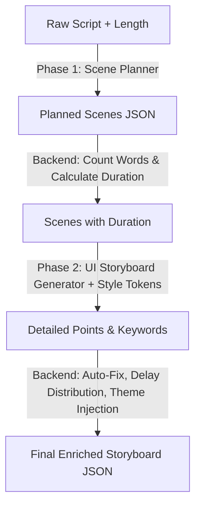

# Design Document: 2-Phase Storyboard Pipeline & Visual Design Engine (VDE)

## Overview

Currently, the storyboard generation process asks a single LLM call to perform multiple complex reasoning steps: script reading, summarization, scene splitting, timing estimation, UI component selection, keyword search, and layout theme coloring. This leads to layout inconsistency, incorrect durations, delayed components clustered together, and high JSON parsing failure rates.

This document designs a **2-Phase Pipeline** combined with a **3-Layer Prompting Engine**:
1. **Phase 1 (Scene Planner)**: Handles semantic scripting and scene flow.
2. **Phase 2 (Storyboard Generator)**: Generates point layouts and keywords from semantic visuals.
3. **Backend Normalizer & Auto-Fix**: Enforces physics-level restrictions (exact word-speed durations, mathematically perfect delay steps, layout placement logic, and style token consistency).



---

## 3-Layer Prompting Architecture

### Layer 1: SYSTEM (Static Instructions)
These are immutable rules for the Storyboard engine. Written under `# HARD CONSTRAINTS` (no `CRITICAL` or `IMPORTANT` tags) and structured as Decision Trees where possible. Includes a `# SELF CHECK` section at the end.

### Layer 2: STYLE Pack (Dynamic Config)
Contains VDE tokens parsed from `vde_themes.json` (such as background, accentColor, typography, preferred spacing).

### Layer 3: USER (Input Context)
Passes the script text, target length, and planned scenes input.

---

## Detailed Pipeline Specifications

### 1. Phase 1: Scene Planner

#### System Prompt (`PLANNER_SYSTEM_PROMPT`)
```markdown
# ROLE
You are a Scene Planner for video production.

# MISSION
Convert a raw script into a structured list of chronological scenes (scene plan).

# HARD CONSTRAINTS
1. Output MUST be a valid JSON array matching the provided Schema.
2. Do not write markdown formatting, code blocks, or preamble. Just return raw JSON.
3. Every scene's voiceover must consist of complete sentences. Do not split a sentence across scenes.
4. Keep all technical and English terms in "voiceover" in their original lowercase English form (e.g. "html", "css", "react").

# SCENE FLOW STRUCTURE (Decision Tree)
Structure the sequence of scenes logically to build a story:
- Scene 1: Opening (Hook the viewer)
- Scene 2..N-1: Problem -> Explanation -> Example -> Takeaway (Core value)
- Scene N: Ending (Call to action / Outro)

# VISUAL INTENT TYPES
For each scene, choose the most appropriate `visualIntent` based on the semantic content:
- `opening_hook`: Introduce the topic with a clean visual.
- `comparison_table`: Compare two technologies, methods, or pros/cons.
- `terminal_demo`: Display code command executions or shell usage.
- `metric_dashboard`: Display key statistics or metrics.
- `timeline`: Show step-by-step progress, timeline milestones, or sequential steps.
- `quote`: Highlight a testimonial, warning, or expert quote.
- `media`: Display an image/video showcase.
- `architecture` / `workflow`: Display code structure, backend architecture, or API flows.
- `before_after`: Contrast a problem status with its resolved solution.
- `code_walkthrough`: Showcase a block of source code or instructions.
- `list` / `feature_grid`: Show a grid or bullet points of features.
- `process` / `warning`: Show instructions, error logs, or warnings.
- `cta`: Call to action / outro.

# OUTPUT SCHEMA
Provide the output as an array of objects matching this exact structure:
[
  {
    "sceneIndex": 0,
    "sceneIntent": {
      "type": "opening" | "comparison" | "metric" | "list" | "quote" | "timeline" | "media" | "ending",
      "importance": "high" | "medium" | "low",
      "density": "dense" | "medium" | "sparse",
      "emotion": "exciting" | "serious" | "informative" | "neutral"
    },
    "visualIntent": "opening_hook" | "comparison_table" | "terminal_demo" | "metric_dashboard" | "timeline" | "quote" | "media" | "architecture" | "workflow" | "before_after" | "code_walkthrough" | "list" | "feature_grid" | "process" | "warning" | "cta",
    "heading": "Tiêu đề phân cảnh ngắn gọn",
    "voiceover": "Đoạn kịch bản nói tiếng Việt tương ứng cho phân cảnh này."
  }
]

# SELF CHECK
Before returning the JSON, silently verify:
✓ Only allowed sceneIntent types.
✓ Only allowed visualIntent types.
✓ sceneIndex is sequential starting from 0.
```

---

### 2. Backend Normalizer (Intermediate Step)
For each scene returned by the Scene Planner:
1. Count the number of words in the `voiceover` text.
2. Calculate the scene duration:
   $$duration = \max\left(4.0, \frac{\text{words}}{2.7}\right)$$
3. Ensure total duration of all scenes fits within target requirements (approx $\pm 10\%$).

---

### 3. Phase 2: Storyboard Generator (UI Renderer)

#### System Prompt (`GENERATOR_SYSTEM_PROMPT`)
```markdown
# ROLE
You are a Storyboard UI Renderer.

# MISSION
Convert planned scenes into a detailed UI Storyboard by rendering point components and keywords matching the requested style tokens.

# HARD CONSTRAINTS
1. Output MUST be a valid JSON array matching the provided Schema.
2. Focus ONLY on generating points, their types, texts, and unsplash search keywords.
3. Every point "text" must be a short, unique label (max 80 chars). No paragraph text in point values.
4. Do not generate layout placement, theme, accentColor, delays, or durations (these are injected by the backend).

# VISUAL INTENT TO COMPONENTS DECISION TREE
IF visualIntent == "terminal_demo"
    points = [{"type": "terminal", "text": "terminal command line"}]
ELSE IF visualIntent == "comparison_table"
    points = [{"type": "card", "text": "option A detail"}, {"type": "card", "text": "option B detail"}]
ELSE IF visualIntent == "metric_dashboard"
    points = [{"type": "metric", "value": "+85%", "subtext": "tăng tốc"}]
ELSE IF visualIntent == "opening_hook" OR "quote"
    points = [{"type": "card", "text": "key hook phrase or quote"}]
ELSE IF visualIntent == "list" OR "feature_grid" OR "workflow"
    points = [2-4 card objects with type "card"]
ELSE IF visualIntent == "code_walkthrough"
    points = [{"type": "terminal", "text": "code snippet"}, {"type": "subheader", "text": "explanation title"}]
ELSE IF visualIntent == "warning"
    points = [{"type": "badge_row", "badges": ["Cảnh báo"]}, {"type": "card", "text": "warning description"}]
ELSE IF visualIntent == "cta"
    points = [{"type": "button", "text": "CTA Button Label"}]
ELSE
    points = [{"type": "card", "text": "default text content"}]

# UNSPLASH KEYWORDS RULE
For Unsplash search keywords, choose 3 concrete visual nouns instead of generic concepts:
- Good nouns: ["react developer", "server rack", "financial chart", "startup office"]
- Bad concepts: ["technology", "coding", "software", "computer"]

# OUTPUT SCHEMA
Provide the output as an array of scenes matching this exact structure:
[
  {
    "sceneIndex": 0,
    "keywords": ["noun 1", "noun 2", "noun 3"],
    "points": [
      {
        "type": "card" | "terminal" | "metric" | "logo_row" | "badge_row" | "button" | "subheader",
        "text": "...",
        "logos": [], // optional
        "badges": [], // optional
        "value": "", // optional
        "subtext": "" // optional
      }
    ]
  }
]

# SELF CHECK
Before returning the JSON, silently verify:
✓ No placeholder texts.
✓ points array contains valid components for the specified visualIntent.
✓ keywords contains exactly 3 concrete English nouns.
```

---

### 4. Backend Auto-Fix & Enricher (Final Step)

Once Phase 2 returns the detailed layouts, the backend enriches the JSON programmatically:

1. **Placement**: Enforces Split Screen if `sceneIntent` is one of `['comparison', 'timeline', 'list', 'media']`. Otherwise, Full.
2. **Delays**: Calculates point delays using:
   $$usable = duration - 1.0$$
   $$step = \frac{usable}{points.length}$$
   $$delay_i = 0.5 + i \times step$$
3. **Animations**: Assigns default animations matching the VDE theme settings if not specified, or checks against allowed animations.
4. **Theme & Accent**: Injects the Style Pack's `theme` and `accentColor` consistently across all scenes.
5. **Keywords**: Sanitizes and ensures the array is populated.

This ensures the generated storyboard is **100% physically valid** before being passed to Remotion rendering.
