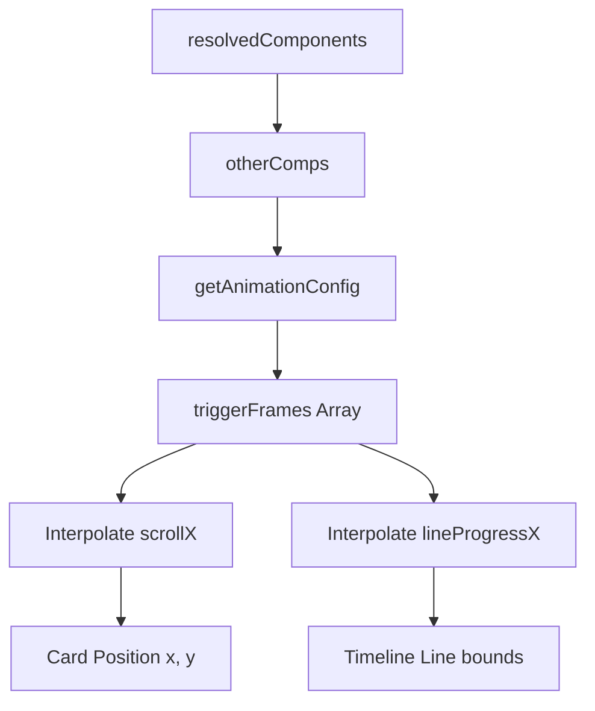

# Timeline Dynamic Timing Alignment Design

**Goal:** Align the line drawing and camera scroll panning speed of **Timeline Beam Rail** exactly with the configured appearance delay (timing) of each content card.

## Selected Approach

**Option 1: Equal Timing Allocation based on Scene Duration**
- Total running duration is exactly `durationInFrames / 2`.
- Interval between cards: `interval = (durationInFrames / 2) / (N - 1)`.
- Card trigger frames: `triggerFrames[idx] = Math.round(idx * interval)`.
- Segment 0 (Frame 0 to `triggerFrames[0]`): Line draws from left edge to center. Node 0 appears, Card 0 pops.
- Segment $i$ (Frame `triggerFrames[i-1]` to `triggerFrames[i]`):
  - Camera `scrollX` translates from `(i - 1) * viewportWidth` to `i * viewportWidth`.
  - Line draws from `(i - 0.5) * viewportWidth` to `(i + 0.5) * viewportWidth`.
- Zoom Out (Starts at `durationInFrames / 2 + 30`, ends at `durationInFrames / 2 + 55`):
  - Scale transitions from `1.0` to `0.95`.
  - Positions shift to final 2-row grid offsets.
  - Timeline line shrinks to centered `580px` segment.

**Option A: Moderate squarish cards, left aligned**
- Card dimensions:
  - Active: width `420px`, height `320px`, padding `24px`
  - Zoomed: width `380px`, height `280px`, padding `20px`
- Text alignment: Left aligned (`textAlign: "left"`, `alignItems: "flex-start"`).
- Font size base: active `30px`, zoomed `22px`.
- Y-offsets (above the line):
  - Active panning phase: `-190px` (above the circle dot).
  - Zoom-out phase: Cards 0/1 slide to `-170px`, Card 2 slides to `+170px`.

**Timeline Chapters (Zig-Zag) Compression**
- Retain the start node: `startPt = { x: 15, y: 10 }`.
- Card/node positions:
  - Card 0: `{ x: 32, y: 26 }`
  - Card 1: `{ x: 68, y: 42 }`
  - Card 2: `{ x: 32, y: 58 }`
- This lifts the bottom card to `58%` Y-position, leaving >600px clean space at the bottom for subtitles, completely in the Safe Zone for TikTok/Reels overlays.
- Ball animation starts at frame 25 and segment timing draws sequentially.

## Components and Data Flow

## Implementation Plan

1. Modify `my-video/src/compositions/layouts/modes/IntroEvidenceTimelineMode.tsx` to read dynamic `triggerFrames`.
2. Update interpolation formulas for `scrollX` and `lineProgressX`.
3. Verify compilation.
