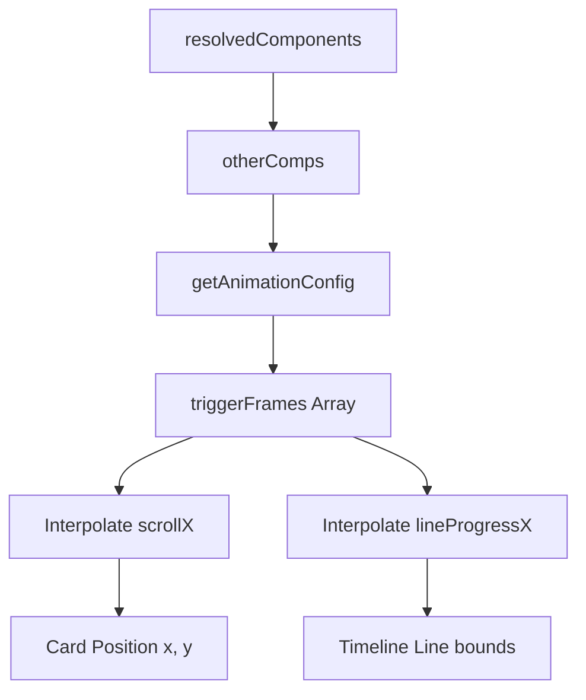

# Timeline Dynamic Timing Alignment Design

**Goal:** Align the line drawing and camera scroll panning speed of **Timeline Beam Rail** exactly with the configured appearance delay (timing) of each content card.

## Selected Approach

**Option 1: Segment-based Interpolation using Component Delays**
- Parse the delay of each card using `getAnimationConfig(comp, idx, "slide-up", defaultDelay, t)`.
- Convert delays to frame indexes: `triggerFrame = Math.round(delay * fps)`.
- Segment 0 (Frame 0 to `triggerFrames[0]`): Line draws from left edge (`x = -viewportWidth / 2`) to center (`x = 0`). Node 0 appears, Card 0 pops.
- Segment $i$ (Frame `triggerFrames[i-1] + 8` to `triggerFrames[i]`):
  - Camera `scrollX` translates from `(i - 1) * viewportWidth` to `i * viewportWidth`.
  - Line draws from `(i - 0.5) * viewportWidth` to `(i + 0.5) * viewportWidth`.
- Zoom Out (Frame `lastTrigger + 25` to `lastTrigger + 50`):
  - Scale transitions from `1.0` to `0.95`.
  - Positions shift to final 2-row grid offsets.
  - Timeline line shrinks to centered `560px` segment.

## Components and Data Flow

## Implementation Plan

1. Modify `my-video/src/compositions/layouts/modes/IntroEvidenceTimelineMode.tsx` to read dynamic `triggerFrames`.
2. Update interpolation formulas for `scrollX` and `lineProgressX`.
3. Verify compilation.
