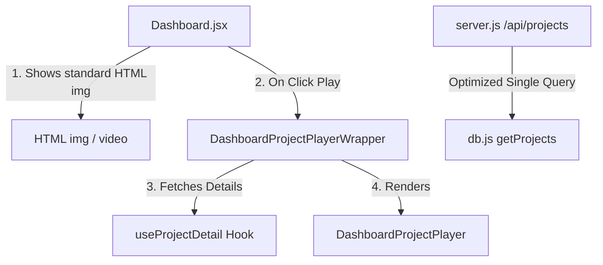

# Design: Performance Optimization for Project Queries and Dashboard

This document details the design to optimize the backend query pipeline and client-side Dashboard rendering to eliminate interface lag and speed up project list loading.

## Goals
1. **Eliminate N+1 Database Queries**: Remove the loop that fetches the full scenes for all projects on every list request.
2. **Minimize Network Payload**: Reduce the JSON response size of `/api/projects` by omitting full scene layouts and compiled code strings, returning only metadata and the first scene thumbnail info.
3. **Remove Browser GPU/CPU Bottleneck**: Replace static card Remotion Player instances in the Dashboard list with standard HTML `` or `<video>` elements.
4. **On-Demand Preview Player**: Load and render the Remotion Player dynamically only when a user clicks the "Play" button on a project card.

---

## Architectural Changes

### 1. Backend SQL Optimization
- Modify `db.getProjects()` in `backend/services/db.js` to run a single query joining `projects` and a subquery selecting the first row from the `scenes` table (`first_scene`).
- Update `/api/projects` in `backend/server.js` to map `first_scene` directly to `scenes: [first_scene]`, removing the heavy `db.getProjectById(p.id)` loop.

### 2. Client-Side Rendering Optimization
- In `frontend/src/components/Dashboard.jsx`:
  - Replace the static card Remotion `<Player>` instance with standard `` or `<video>` elements.
  - Introduce `DashboardProjectPlayerWrapper` which fetches the project detail using `useProjectDetail(projectId)` only when mounted (i.e. when `playingProjectId === project.id`).

---

## Verification Plan

### Automated Verification
1. Run `npm run build` in the `frontend/` directory to ensure no compilation issues.
2. Run backend server and check query performance logs in database / console output.

### Manual Verification
1. Verify the Home Dashboard loads instantly.
2. Monitor browser memory and CPU usage during scrolling to ensure it remains clean.
3. Click "Play" on a project card and verify the preview player plays the composition accurately.
