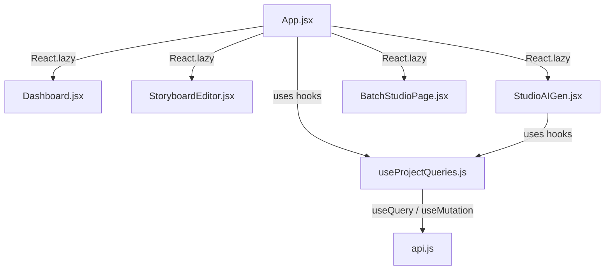

# Design: Query Optimization with TanStack Query & Component Lazy Loading

This document outlines the design to optimize the frontend query fetching and component rendering to improve performance and remove user-interface lag.

## Goals
1. **Reduce UI Lag**: Prevent redundant network requests when switching views (e.g. switching between PROJECTS, STUDIO, BATCH views).
2. **Bundle Splitting**: Lazy-load heavy components (`Dashboard`, `StoryboardEditor`, `StudioAIGen`, `BatchStudioPage`, etc.) to improve the initial loading speed.
3. **Decoupled API Logic**: Migrate direct `useEffect` fetches into structured custom React Query Hooks.
4. **Premium UX**: Implement a premium Glassmorphic Shimmer Skeleton Loader to show during component lazy-loading transition states.

---

## Architectural Changes

### 1. TanStack Query Configuration
- Add `@tanstack/react-query` to `package.json`.
- Initialize `QueryClient` in `main.jsx` with reasonable defaults:
  - `staleTime`: 5 minutes (data remains fresh to avoid unnecessary refetches).
  - `refetchOnWindowFocus`: `false`.
  - `retry`: 1.

### 2. Custom Hooks (`frontend/src/hooks/useProjectQueries.js`)
Centralize API queries and mutations:
- **Queries**:
  - `useProjects()`: Calls `api.getProjects()`. Cached under key `['projects']`.
  - `useProjectDetail(id)`: Calls `api.getProjectById(id)`. Cached under key `['projects', id]`. Enabled only when `id` is present.
- **Mutations**:
  - `useCreateProject()`: Posts new project, invalidates `['projects']`.
  - `useDeleteProject()`: Deletes project, invalidates `['projects']`.
  - `useUpdateProjectConfig()`: Updates config, invalidates `['projects', id]`.
  - `useUpdateScene()`: Updates a scene, invalidates `['projects', projectId]`.
  - `useRegenerateTts()`: Triggers TTS generation, invalidates `['projects', projectId]`.
  - `useRegenerateSceneTts()`: Triggers single scene TTS, invalidates `['projects', projectId]`.
  - `useGenerateStoryboard()`: Triggers storyboard generation, invalidates `['projects', projectId]`.

### 3. Lazy Loading & Skeleton UI (`frontend/src/components/SkeletonLoader.jsx`)
- Lazy load major sub-components using `React.lazy()` + named export wrappers.
- Wrap dynamic views in `<Suspense fallback={<SkeletonLoader type={viewType} />}>`.
- Define a beautiful shimmer skeleton with CSS:
  - Shimmer effect using CSS gradient animation `@keyframes shimmer`.
  - Premium design consistent with the light glassmorphic theme.

### 4. Component Refactoring
- **`App.jsx`**:
  - Remove local states `projects`, `currentProject`, `loading`, `toast`.
  - Inject custom hooks for loading projects and project details.
  - Bind UI event handlers to React Query mutations.
- **`StudioAIGen.jsx`**:
  - Remove manual `api.getProjectById(projectId)` fetching inside `useEffect`.
  - Use `useProjectDetail(projectId)` and synchronize the data with local inputs.

---

## Verification Plan

### Manual Verification
1. Verify package installation completes without conflicts.
2. Check initial app load time and observe bundle splitting in browser Network tab (separate chunk JS files loaded on-demand).
3. Test switching views back-and-forth between Home, Studio AI Gen, and Storyboard Editor to verify there is no lag or reloading spinner.
4. Verify all actions (create project, edit scene, generate storyboard, delete project) work correctly and UI is updated instantly via invalidating caches.
